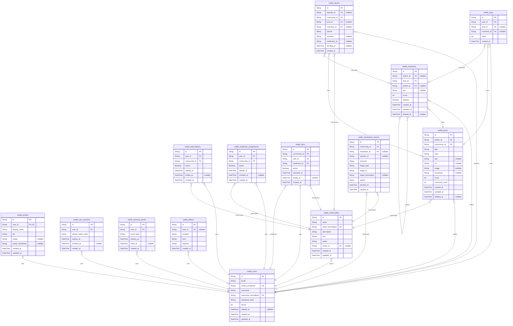

# Prisma Markdown

> Generated by [`prisma-markdown`](https://github.com/samchon/prisma-markdown)

- [default](#default)

## default

### `reddit_users`

One platform account, including reserved identifiers retained after deletion.

Properties as follows:

- `id`: Application-assigned UUID.
- `email`: Original email spelling used only for the owning account.
- `email_normalized`: Trimmed case-folded email used for uniqueness and sign-in.
- `username`: Public username spelling.
- `username_normalized`: Trimmed case-folded username used for uniqueness.
- `password_hash`: One-way password representation.
- `karma`: Signed karma from currently available authored content.
- `deleted_at`: Permanent deletion marker; identifiers remain reserved when non-null.
- `created_at`: Account creation instant.
- `updated_at`: Last account mutation instant.

### `reddit_profiles`

Public attributes belonging one-to-one to an account.

Properties as follows:

- `id`: Application-assigned UUID.
- `user_id`: Owning account identifier.
- `display_name`: Public display name.
- `bio`: Public biography, possibly empty.
- `avatar`: Optional accepted avatar payload.
- `avatar_thumbnail`: Optional bounded avatar presentation payload.
- `created_at`: Profile creation instant.
- `updated_at`: Last profile mutation instant.

### `reddit_user_sessions`

One authenticated connection, independently revocable from other sessions.

Properties as follows:

- `id`: Application-assigned UUID.
- `user_id`: Owning account identifier.
- `refresh_token_hash`: Hash of the current refresh proof.
- `expires_at`: Session expiration instant.
- `revoked_at`: Revocation instant, or null while active.
- `created_at`: Session creation instant.

### `reddit_recovery_proofs`

A one-time password recovery proof that is never returned as account data.

Properties as follows:

- `id`: Application-assigned UUID.
- `user_id`: Account authorized by the proof.
- `proof_hash`: Hash of the delivered one-time proof.
- `expires_at`: Expiration instant.
- `used_at`: Consumption instant, or null while unused.
- `created_at`: Proof creation instant.

### `reddit_effects`

A durable record for an external delivery the local workspace cannot perform.

Properties as follows:

- `id`: Application-assigned UUID.
- `user_id`: Optional account addressed by the effect.
- `recipient`: Destination address, such as a registered email.
- `kind`: Effect kind.
- `payload`: Structured payload retained for the delivery boundary.
- `created_at`: Effect recording instant.

### `reddit_communities`

A public discussion community and its current ownership state.

Properties as follows:

- `id`: Application-assigned UUID.
- `name`: Public community name spelling.
- `name_normalized`: Trimmed case-folded name used for uniqueness and search ordering.
- `description`: Public community description.
- `icon`: Accepted public icon payload.
- `status`: Active or archived lifecycle state.
- `owner_id`: Current owner account identifier, null only after archival.
- `created_at`: Community creation instant.
- `updated_at`: Last community mutation instant.

### `reddit_subscriptions`

One user-community subscription with retained tenure and end state.

Properties as follows:

- `id`: Application-assigned UUID.
- `user_id`: Subscriber account identifier.
- `community_id`: Community identifier.
- `active`: Whether this relationship is currently active.
- `started_at`: Current subscription start instant.
- `ended_at`: End instant for the current subscription, or null while active.
- `created_at`: Relationship creation instant.

### `reddit_moderator_assignments`

A scoped moderator assignment with revocation retained as history.

Properties as follows:

- `id`: Application-assigned UUID.
- `user_id`: Moderator account identifier.
- `community_id`: Community identifier.
- `active`: Whether this assignment is currently active.
- `started_at`: Assignment start instant used for succession tenure.
- `revoked_at`: Revocation instant, or null while active.
- `created_at`: Assignment creation instant.

### `reddit_bans`

One community ban, active until explicitly ended.

Properties as follows:

- `id`: Application-assigned UUID.
- `community_id`: Community identifier.
- `user_id`: Banned account identifier.
- `moderator_id`: Account that applied the ban.
- `active`: Whether the restriction is active.
- `activated_at`: Ban activation instant.
- `ended_at`: Unban instant, or null while active.
- `created_at`: Ban record creation instant.

### `reddit_posts`

A post with exactly one type-specific payload and immutable identity links.

Properties as follows:

- `id`: Application-assigned UUID.
- `author_id`: Owning author identifier.
- `community_id`: Containing community identifier.
- `title`: Reader-facing title.
- `type`: Text, link, or image discriminator.
- `text`: Text payload for text posts.
- `url`: URL payload for link posts.
- `image`: Full image payload for image posts.
- `thumbnail`: Bounded image preview payload.
- `score`: Materialized active vote score.
- `comment_count`: Materialized count of available comments.
- `created_at`: Original creation instant used by all rankings and age displays.
- `updated_at`: Last content edit instant.
- `deleted_at`: Permanent deletion marker used before dependent cleanup.

### `reddit_comments`

A recursive comment node whose deleted row may preserve descendant position.

Properties as follows:

- `id`: Application-assigned UUID.
- `author_id`: Owning author identifier, null after de-identifying deletion.
- `post_id`: Containing post identifier.
- `parent_id`: Immediate parent comment, or null for a top-level comment.
- `text`: Comment text, null after content deletion.
- `score`: Materialized active vote score.
- `deleted`: Whether the row is a neutral deleted marker.
- `created_at`: Original creation instant.
- `updated_at`: Last content edit instant.
- `deleted_at`: Content deletion instant, or null while available.

### `reddit_votes`

One signed vote on exactly one post or comment.

Properties as follows:

- `id`: Application-assigned UUID.
- `user_id`: Voter account identifier.
- `post_id`: Post target, when this is a post vote.
- `comment_id`: Comment target, when this is a comment vote.
- `value`: Signed direction, +1 or -1.
- `created_at`: Vote creation or latest transition instant.

### `reddit_reports`

A pending or resolved report on one available content target.

Properties as follows:

- `id`: Application-assigned UUID.
- `reporter_id`: Reporting account identifier, nullable after de-identification.
- `community_id`: Community containing the target.
- `post_id`: Post target, when this is a post report.
- `comment_id`: Comment target, when this is a comment report.
- `reason`: Trimmed report reason.
- `outcome`: Null while unresolved; otherwise approved or dismissed.
- `moderator_id`: Decision actor, nullable after de-identification.
- `decided_at`: Decision instant, or null while unresolved.
- `created_at`: Report submission instant.

### `reddit_moderation_actions`

Private resolved moderation action with only requirement-prescribed details.

Properties as follows:

- `id`: Application-assigned UUID.
- `community_id`: Community where the action occurred.
- `moderator_id`: Acting moderator, nullable after account deletion.
- `reporter_id`: Former reporter, nullable after account deletion.
- `outcome`: Approved or dismissed outcome.
- `target_type`: Target kind.
- `target_id`: Target identifier retained only as a non-public correlation.
- `target_description`: Target description when it still exists.
- `reason`: Original report reason.
- `decided_at`: Decision instant.
- `created_at`: History creation instant.
