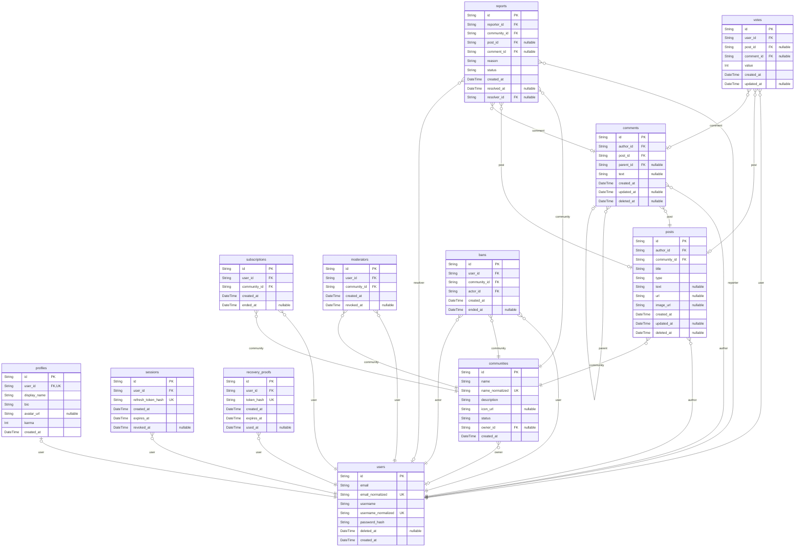

# Prisma Markdown

> Generated by [`prisma-markdown`](https://github.com/samchon/prisma-markdown)

- [default](#default)

## default

### `users`

Platform account with private credentials and a permanently reservable identity.

Properties as follows:

- `id`: UUID primary key.
- `email`: Case-preserved sign-in email.
- `email_normalized`: Lower-cased sign-in email used for uniqueness.
- `username`: Public username.
- `username_normalized`: Lower-cased username used for uniqueness.
- `password_hash`: Password hash; never exposed.
- `deleted_at`: Permanent deletion instant; null while active.
- `created_at`: Creation instant.

### `profiles`

Public profile belonging one-to-one to an account.

Properties as follows:

- `id`: UUID primary key.
- `user_id`: Owning account identifier.
- `display_name`: Public display name.
- `bio`: Public biography, possibly empty.
- `avatar_url`: Optional public avatar URL or data reference.
- `karma`: Signed karma aggregate.
- `created_at`: Creation instant.

### `sessions`

Independent authenticated connection for one account.

Properties as follows:

- `id`: UUID primary key.
- `user_id`: Account identifier.
- `refresh_token_hash`: Hash of the refresh proof.
- `created_at`: Session creation instant.
- `expires_at`: Expiration instant.
- `revoked_at`: Revocation instant; null while active.

### `recovery_proofs`

One-time password recovery proof.

Properties as follows:

- `id`: UUID primary key.
- `user_id`: Account identifier.
- `token_hash`: Hash of the emailed proof.
- `created_at`: Creation instant.
- `expires_at`: Expiration instant.
- `used_at`: Consumption instant; null while unused.

### `communities`

Public discussion community and its current owner.

Properties as follows:

- `id`: UUID primary key.
- `name`: Case-preserved public name.
- `name_normalized`: Lower-cased searchable name.
- `description`: Public description.
- `icon_url`: Optional public icon reference.
- `status`: Active or archived lifecycle state.
- `owner_id`: Current owner account identifier; null once archived.
- `created_at`: Creation instant.

### `subscriptions`

User membership in a community, retaining tenure after ending.

Properties as follows:

- `id`: UUID primary key.
- `user_id`: Subscriber account identifier.
- `community_id`: Community identifier.
- `created_at`: Activation instant.
- `ended_at`: End instant; null while active.

### `moderators`

Community-scoped moderator assignment with tenure and revocation.

Properties as follows:

- `id`: UUID primary key.
- `user_id`: Moderator account identifier.
- `community_id`: Community identifier.
- `created_at`: Assignment instant.
- `revoked_at`: Revocation instant; null while current.

### `posts`

User-authored post with exactly one type-specific payload.

Properties as follows:

- `id`: UUID primary key.
- `author_id`: Author account identifier.
- `community_id`: Community identifier.
- `title`: Required public title.
- `type`: text, link, or image.
- `text`: Text payload when type is text.
- `url`: URL payload when type is link.
- `image_url`: Image payload reference when type is image.
- `created_at`: Immutable creation instant.
- `updated_at`: Last edit instant.
- `deleted_at`: Deletion instant; null while available.

### `comments`

Nested user-authored comment; parent is optional for top-level comments.

Properties as follows:

- `id`: UUID primary key.
- `author_id`: Author account identifier.
- `post_id`: Parent post identifier.
- `parent_id`: Immediate parent comment identifier; null for top-level.
- `text`: Comment text, nulled when content is deleted.
- `created_at`: Immutable creation instant.
- `updated_at`: Last edit instant.
- `deleted_at`: Deletion instant; null while available.

### `votes`

One user's current vote on one post or comment target.

Properties as follows:

- `id`: UUID primary key.
- `user_id`: Voter account identifier.
- `post_id`: Post target, mutually exclusive with comment_id.
- `comment_id`: Comment target, mutually exclusive with post_id.
- `value`: +1 upvote or -1 downvote.
- `created_at`: Creation instant.
- `updated_at`: Last transition instant.

### `reports`

Content report with unresolved and terminal moderation outcomes.

Properties as follows:

- `id`: UUID primary key.
- `reporter_id`: Reporter account identifier.
- `community_id`: Community owning the target.
- `post_id`: Post target, mutually exclusive with comment_id.
- `comment_id`: Comment target, mutually exclusive with post_id.
- `reason`: Trimmed report reason.
- `status`: unresolved, approved, or dismissed.
- `created_at`: Submission instant.
- `resolved_at`: Resolution instant.
- `resolver_id`: Moderator who resolved the report.

### `bans`

Community ban history with active and ended periods.

Properties as follows:

- `id`: UUID primary key.
- `user_id`: Banned account identifier.
- `community_id`: Community identifier.
- `actor_id`: Acting moderator account identifier.
- `created_at`: Activation instant.
- `ended_at`: End instant; null while active.
