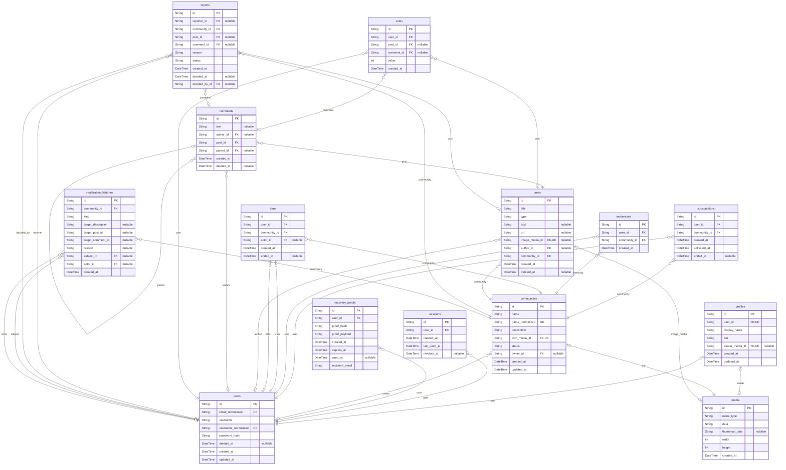

# Prisma Markdown

> Generated by [`prisma-markdown`](https://github.com/samchon/prisma-markdown)

- [default](#default)

## default

### `users`

A platform account and its private credentials.

Properties as follows:

- `id`: Primary identifier.
- `email_normalized`: Case-normalized sign-in address, retained after deletion.
- `username`: Public username in its selected casing.
- `username_normalized`: Case-normalized public identifier.
- `password_hash`: Password hash; never exposed by the API.
- `deleted_at`: Permanent deletion instant, or null while active.
- `created_at`: Account creation instant.
- `updated_at`: Last account mutation instant.

### `profiles`

Public attributes belonging one-to-one to an account.

Properties as follows:

- `id`: Primary identifier, equal to the user identifier.
- `user_id`: Owning account.
- `display_name`: Public display name.
- `bio`: Public biography, possibly empty.
- `avatar_media_id`: Optional avatar media identifier.
- `created_at`: Profile creation instant.
- `updated_at`: Last public edit instant.

### `sessions`

One independently revocable authenticated connection.

Properties as follows:

- `id`: Primary identifier.
- `user_id`: Owning account identifier.
- `created_at`: Session creation instant.
- `last_used_at`: Last continuation instant.
- `revoked_at`: Revocation instant, or null while active.

### `recovery_proofs`

A one-time password-recovery proof delivery record.

Properties as follows:

- `id`: Primary identifier.
- `user_id`: Account receiving the proof.
- `proof_hash`: Hash of the secret delivered out of band.
- `proof_payload`: Secret payload carried by the recorded delivery boundary.
- `created_at`: Creation instant.
- `expires_at`: Expiration instant.
- `used_at`: Consumption instant, or null while unused.
- `recipient_email`: Registered recipient address.

### `media`

An uploaded public image and its presentation metadata.

Properties as follows:

- `id`: Primary identifier.
- `mime_type`: Accepted MIME type.
- `data`: Original encoded image bytes represented as base64.
- `thumbnail_data`: Bounded thumbnail bytes for image posts, or null for other media.
- `width`: Original pixel width.
- `height`: Original pixel height.
- `created_at`: Creation instant.

### `communities`

A public community and its scoped authority.

Properties as follows:

- `id`: Primary identifier.
- `name`: Public name in selected casing.
- `name_normalized`: Case-normalized name used for uniqueness and search.
- `description`: Public description.
- `icon_media_id`: Required public icon media.
- `status`: Active or permanently archived status.
- `owner_id`: Current owner identifier, or null for an archived community.
- `created_at`: Creation instant.
- `updated_at`: Last public mutation instant.

### `subscriptions`

One user's current or historical relationship with a community.

Properties as follows:

- `id`: Primary identifier.
- `user_id`: User identifier.
- `community_id`: Community identifier.
- `created_at`: First activation instant.
- `activated_at`: Most recent activation instant.
- `ended_at`: End instant, or null while active.

### `moderators`

A community-scoped moderator assignment.

Properties as follows:

- `id`: Primary identifier.
- `user_id`: Assigned user.
- `community_id`: Community.
- `created_at`: Assignment instant used for succession tenure.

### `bans`

A current or historical community participation ban.

Properties as follows:

- `id`: Primary identifier.
- `user_id`: Banned user identifier.
- `community_id`: Community identifier.
- `actor_id`: Acting moderator identifier, nullable after account deletion.
- `created_at`: Activation instant.
- `ended_at`: End instant, or null while active.

### `posts`

A post with exactly one type-specific payload.

Properties as follows:

- `id`: Primary identifier.
- `title`: Required title.
- `type`: Text, link, or image discriminator.
- `text`: Text payload for text posts.
- `url`: URL payload for link posts.
- `image_media_id`: Image payload identifier for image posts.
- `author_id`: Author identifier, nullable only after account deletion.
- `community_id`: Community identifier.
- `created_at`: Immutable creation instant.
- `deleted_at`: Permanent deletion instant, or null while available.

### `comments`

A recursive comment tree node.

Properties as follows:

- `id`: Primary identifier.
- `text`: Comment text, null after content deletion.
- `author_id`: Author, null when a deleted marker de-identifies the account.
- `post_id`: Post identifier.
- `parent_id`: Immediate parent, or null for a top-level comment.
- `created_at`: Immutable creation instant.
- `deleted_at`: Content deletion instant, or null while available.

### `votes`

One active signed vote on one post or comment.

Properties as follows:

- `id`: Primary identifier.
- `user_id`: Voter identifier.
- `post_id`: Post target, mutually exclusive with comment_id.
- `comment_id`: Comment target, mutually exclusive with post_id.
- `value`: Signed value, +1 or -1.
- `created_at`: Creation or last direction-change instant.

### `reports`

A pending or resolved private content report.

Properties as follows:

- `id`: Primary identifier.
- `reporter_id`: Reporter, nullable after account deletion.
- `community_id`: Community owning the target.
- `post_id`: Post target, mutually exclusive with comment_id.
- `comment_id`: Comment target, mutually exclusive with post_id.
- `reason`: Nonblank reason supplied by the reporter.
- `status`: unresolved, approved, or dismissed.
- `created_at`: Submission instant.
- `decided_at`: Decision instant, or null while unresolved.
- `decided_by_id`: Acting moderator, nullable after deletion.

### `moderation_histories`

Private immutable record of a moderation decision.

Properties as follows:

- `id`: Primary identifier.
- `community_id`: Community identifier.
- `kind`: approved, dismissed, deleted, banned, or unbanned.
- `target_description`: Target description retained only while target exists.
- `target_post_id`: Target post identifier while the target remains available.
- `target_comment_id`: Target comment identifier while the target remains available.
- `reason`: Reason when this record came from a report.
- `subject_id`: Subject account, nullable after de-identification.
- `actor_id`: Acting account, nullable after de-identification.
- `created_at`: Event instant.
