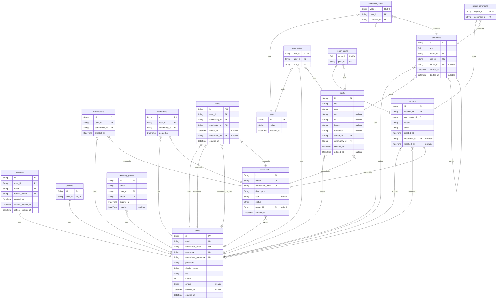

# Prisma Markdown

> Generated by [`prisma-markdown`](https://github.com/samchon/prisma-markdown)

- [default](#default)

## default

### `users`

Account identity and profile.

Properties as follows:

- `id`: Primary key.
- `email`: Private sign-in email.
- `normalized_email`: Case-folded email used for identity uniqueness.
- `username`: Public unique username.
- `normalized_username`: Case-folded username used for identity uniqueness.
- `password`: Password hash.
- `display_name`: Public display name.
- `bio`: Public biography.
- `karma`: Signed karma total derived from active received votes.
- `avatar`: Optional avatar payload.
- `deleted_at`: Permanent deletion marker.
- `created_at`: Creation instant.

### `sessions`

Authenticated session.

Properties as follows:

- `id`: Primary key.
- `user_id`: Owning user identifier.
- `token`: Access token digest.
- `refresh_token`: Refresh token digest.
- `created_at`: Creation instant.
- `access_expires_at`: Access-token expiry instant.
- `refresh_expires_at`: Refresh-token expiry instant.

### `profiles`

Public profile projection.

Properties as follows:

- `id`: Primary key and user identifier.
- `user_id`: Owning user identifier.

### `communities`

Public discussion community.

Properties as follows:

- `id`: Primary key.
- `name`: Stable public name.
- `normalized_name`: Normalized lookup name.
- `description`: Public description.
- `icon`: Optional icon payload.
- `status`: Active or archived state.
- `owner_id`: Current owner identifier.
- `created_at`: Creation instant.

### `subscriptions`

Active user-community subscription.

Properties as follows:

- `id`: Primary key.
- `user_id`: User identifier.
- `community_id`: Community identifier.
- `created_at`: Activation instant.

### `moderators`

Community-scoped moderator assignment.

Properties as follows:

- `id`: Primary key.
- `user_id`: User identifier.
- `community_id`: Community identifier.
- `created_at`: Assignment instant.

### `bans`

Community participation ban.

Properties as follows:

- `id`: Primary key.
- `user_id`: Banned user identifier.
- `community_id`: Community identifier.
- `moderator_id`: Moderator identifier.
- `ended_at`: Ending instant for resolved ban history.
- `unbanned_by`: User who ended the ban.
- `created_at`: Activation instant.

### `posts`

Community post.

Properties as follows:

- `id`: Primary key.
- `title`: Post title.
- `type`: Payload kind.
- `text`: Text payload.
- `url`: Link payload.
- `image`: Image payload.
- `thumbnail`: Aspect-preserving image thumbnail.
- `author_id`: Author identifier.
- `community_id`: Community identifier.
- `created_at`: Immutable creation instant.
- `deleted_at`: Deletion instant.

### `comments`

Nested post comment.

Properties as follows:

- `id`: Primary key.
- `text`: Comment text.
- `author_id`: Author identifier.
- `post_id`: Post identifier.
- `parent_id`: Optional parent identifier.
- `created_at`: Immutable creation instant.
- `deleted_at`: Deletion instant.

### `votes`

Shared vote value and lifecycle row; exactly one subtype owns its target.

Properties as follows:

- `id`: Primary key.
- `value`: Up or down.
- `created_at`: Creation instant.

### `post_votes`

User vote targeting one post; the unique pair prevents duplicate active votes.

Properties as follows:

- `vote_id`: Shared vote identifier and primary key.
- `user_id`: Voter identifier.
- `post_id`: Target post identifier.

### `comment_votes`

User vote targeting one comment; the unique pair prevents duplicate active votes.

Properties as follows:

- `vote_id`: Shared vote identifier and primary key.
- `user_id`: Voter identifier.
- `comment_id`: Target comment identifier.

### `reports`

Content report and its terminal moderation outcome.

Properties as follows:

- `id`: Primary key.
- `reporter_id`: Reporter identifier.
- `community_id`: Community identifier.
- `reason`: Reason text.
- `status`: Pending, approved, or dismissed.
- `created_at`: Submission instant.
- `moderator_id`: Moderator who resolved the report.
- `resolved_at`: Resolution instant.

### `report_posts`

Post target for one report, enforcing exactly one report target subtype.

Properties as follows:

- `report_id`: Report identifier and primary key.
- `post_id`: Target post identifier.

### `report_comments`

Comment target for one report, enforcing exactly one report target subtype.

Properties as follows:

- `report_id`: Report identifier and primary key.
- `comment_id`: Target comment identifier.

### `recovery_proofs`

One-time password recovery proof.

Properties as follows:

- `id`: Primary key.
- `email`: Normalized email requested for recovery.
- `user_id`: Owning user.
- `proof`: Hashed or opaque proof value.
- `expires_at`: Expiry instant.
- `used_at`: Consumption instant, if used.
