# Prisma Markdown

> Generated by [`prisma-markdown`](https://github.com/samchon/prisma-markdown)

- [default](#default)

## default

```mermaid
erDiagram
"shopping_customers" {
  String id PK
  String email UK
  String password_hash
  String login_status
  DateTime created_at
  DateTime updated_at
  DateTime deleted_at "nullable"
  String display_name "nullable"
  String phone_number "nullable"
}
"shopping_customer_sessions" {
  String id PK
  String customer_id FK
  String refresh_token_hash UK
  DateTime created_at
  DateTime expired_at
  DateTime revoked_at "nullable"
}
"shopping_customer_profiles" {
  String id PK
  String customer_id FK,UK
  String display_name
  String phone_number
  DateTime created_at
  DateTime updated_at
}
"shopping_customer_addresses" {
  String id PK
  String customer_id FK
  String recipient_name
  String recipient_phone
  String street_address
  String city
  String state_or_province
  String postal_code
  String country
  Boolean is_default
  DateTime created_at
  DateTime updated_at
}
"shopping_sellers" {
  String id PK
  String email UK
  String password_hash
  String approval_status
  String login_status
  DateTime suspended_at "nullable"
  DateTime created_at
  DateTime updated_at
  DateTime deleted_at "nullable"
  String shop_name "nullable"
  String shop_description "nullable"
  String logo_image "nullable"
}
"shopping_seller_sessions" {
  String id PK
  String seller_id FK
  String refresh_token_hash UK
  DateTime created_at
  DateTime expired_at
  DateTime revoked_at "nullable"
}
"shopping_seller_profiles" {
  String id PK
  String seller_id FK,UK
  String shop_name
  String shop_description
  String logo_image
  DateTime created_at
  DateTime updated_at
}
"shopping_seller_approval_requests" {
  String id PK
  String seller_id FK
  String reason
  String status
  String decision_reason "nullable"
  DateTime created_at
  DateTime decided_at "nullable"
  String decided_by "nullable"
}
"shopping_seller_profile_snapshots" {
  String id PK
  String seller_id
  String changed_fields
  String before_shop_name
  String after_shop_name
  String before_shop_description
  String after_shop_description
  String before_logo_image
  String after_logo_image
  DateTime created_at
}
"shopping_delivery_challenges" {
  String id PK
  String actor_type
  String actor_id
  String recipient
  String kind
  String payload
  DateTime created_at
  DateTime expired_at
  DateTime consumed_at "nullable"
}
"shopping_administrator_grades" {
  String id PK
  String actor_type
  String actor_id
  String grade
  DateTime created_at
}
"shopping_administrator_grade_events" {
  String id PK
  String actor_id
  String target_type
  String target_id
  String action
  DateTime created_at
}
"shopping_categories" {
  String id PK
  String name
  String description
  String parent_id "nullable"
  DateTime created_at
  DateTime updated_at
  DateTime deleted_at "nullable"
}
"shopping_products" {
  String id PK
  String seller_id FK
  String category_id "nullable"
  String name
  String description
  Float base_price
  DateTime created_at
  DateTime updated_at
  DateTime deleted_at "nullable"
}
"shopping_product_images" {
  String id PK
  String product_id FK
  String uri
  Int sequence
  DateTime created_at
}
"shopping_product_variants" {
  String id PK
  String product_id FK
  String sku_code UK
  String option_values
  Float price_override "nullable"
  DateTime deleted_at "nullable"
  DateTime created_at
  DateTime updated_at
}
"shopping_inventory_movements" {
  String id PK
  String variant_id FK
  Int quantity_delta
  String reason
  String order_item_id "nullable"
  DateTime created_at
}
"shopping_product_snapshots" {
  String id PK
  String product_id FK
  String seller_id
  String name
  String description
  String category_id "nullable"
  Float base_price
  String aggregate
  String changed_fields
  DateTime created_at
}
"shopping_wishlist_entries" {
  String id PK
  String customer_id FK
  String product_id FK
  DateTime created_at
}
"shopping_carts" {
  String id PK
  String customer_id FK,UK
  DateTime created_at
  DateTime updated_at
}
"shopping_cart_lines" {
  String id PK
  String cart_id FK
  String variant_id FK
  Int quantity
  DateTime created_at
  DateTime updated_at
}
"shopping_orders" {
  String id PK
  String order_number UK
  String customer_id FK
  DateTime purchased_at
  Float total_price
  String shipping_recipient_name
  String shipping_recipient_phone
  String shipping_street_address
  String shipping_city
  String shipping_state_or_province
  String shipping_postal_code
  String shipping_country
  DateTime created_at
}
"shopping_order_items" {
  String id PK
  String order_id FK
  String seller_id
  String variant_id "nullable"
  String product_id
  String product_name
  String product_description
  String sku_code
  String option_values
  String seller_shop_name
  String seller_logo_image
  Int quantity
  Float unit_price
  String status
  DateTime purchased_at
}
"shopping_order_item_snapshots" {
  String id PK
  String order_item_id FK
  String kind
  String before_state
  String after_state
  String payload
  DateTime created_at
}
"shopping_payment_attempts" {
  String id PK
  String customer_id
  String idempotency_key UK
  String status
  Float amount
  String gateway_reference "nullable"
  String detail "nullable"
  DateTime created_at
  DateTime completed_at "nullable"
}
"shopping_shipments" {
  String id PK
  String order_id FK
  String seller_id FK
  String carrier
  String tracking_number
  DateTime shipped_at
  DateTime delivered_at "nullable"
}
"shopping_shipment_items" {
  String id PK
  String shipment_id FK
  String order_item_id FK,UK
}
"shopping_cancellation_requests" {
  String id PK
  String order_item_id FK
  String customer_id
  String seller_id
  String reason
  String status
  DateTime created_at
  DateTime decided_at "nullable"
  String decided_by "nullable"
}
"shopping_cancellation_snapshots" {
  String id PK
  String request_id FK
  String reason
  String before_status
  String after_status
  String decided_by
  DateTime created_at
}
"shopping_refund_requests" {
  String id PK
  String order_item_id FK
  String customer_id
  String seller_id
  String reason
  String status
  DateTime deadline_at
  DateTime created_at
  DateTime decided_at "nullable"
  String decided_by "nullable"
}
"shopping_refund_snapshots" {
  String id PK
  String request_id FK
  String reason
  String before_status
  String after_status
  String decided_by
  DateTime created_at
}
"shopping_reviews" {
  String id PK
  String customer_id FK
  String product_id FK
  String order_id
  Int rating
  String text "nullable"
  DateTime published_at
  DateTime updated_at
  DateTime deleted_at "nullable"
  Boolean anonymized
}
"shopping_review_snapshots" {
  String id PK
  String review_id FK
  Int before_rating
  Int after_rating
  String before_text "nullable"
  String after_text "nullable"
  String changed_fields
  DateTime created_at
}
"shopping_administrator_requests" {
  String id PK
  String actor_type
  String actor_id
  String reason
  String status
  String decided_by "nullable"
  DateTime created_at
  DateTime decided_at "nullable"
}
"shopping_moderation_events" {
  String id PK
  String administrator_id
  String target_type
  String target_id
  String action
  String reason
  String before_state
  String after_state
  DateTime created_at
}
"shopping_customer_sessions" }o--|| "shopping_customers" : customer
"shopping_customer_profiles" |o--|| "shopping_customers" : customer
"shopping_customer_addresses" }o--|| "shopping_customers" : customer
"shopping_seller_sessions" }o--|| "shopping_sellers" : seller
"shopping_seller_profiles" |o--|| "shopping_sellers" : seller
"shopping_seller_approval_requests" }o--|| "shopping_sellers" : seller
"shopping_products" }o--|| "shopping_sellers" : seller
"shopping_product_images" }o--|| "shopping_products" : product
"shopping_product_variants" }o--|| "shopping_products" : product
"shopping_inventory_movements" }o--|| "shopping_product_variants" : variant
"shopping_product_snapshots" }o--|| "shopping_products" : product
"shopping_wishlist_entries" }o--|| "shopping_customers" : customer
"shopping_wishlist_entries" }o--|| "shopping_products" : product
"shopping_carts" |o--|| "shopping_customers" : customer
"shopping_cart_lines" }o--|| "shopping_carts" : cart
"shopping_cart_lines" }o--|| "shopping_product_variants" : variant
"shopping_orders" }o--|| "shopping_customers" : customer
"shopping_order_items" }o--|| "shopping_orders" : order
"shopping_order_item_snapshots" }o--|| "shopping_order_items" : order_item
"shopping_shipments" }o--|| "shopping_orders" : order
"shopping_shipments" }o--|| "shopping_sellers" : seller
"shopping_shipment_items" }o--|| "shopping_shipments" : shipment
"shopping_shipment_items" |o--|| "shopping_order_items" : order_item
"shopping_cancellation_requests" }o--|| "shopping_order_items" : order_item
"shopping_cancellation_snapshots" }o--|| "shopping_cancellation_requests" : request
"shopping_refund_requests" }o--|| "shopping_order_items" : order_item
"shopping_refund_snapshots" }o--|| "shopping_refund_requests" : request
"shopping_reviews" }o--|| "shopping_customers" : customer
"shopping_reviews" }o--|| "shopping_products" : product
"shopping_review_snapshots" }o--|| "shopping_reviews" : review
```

### `shopping_customers`

Active customer credentials and lifecycle state.

@evidence docs/analysis/01-actors-and-auth.md#req-customer-identity-customer-identity-and-credential-lifecycle Stores
the customer identity, credentials, sessions' owner, and closure state.
@evidence docs/analysis/01-actors-and-auth.md#req-access-boundaries-identity-and-permission-boundaries Stores the persisted access-boundary state used by the platform.
@evidence docs/analysis/02-domain-model.md#req-cancellation-domain-cancellation-request-lifecycle Retains the identity side of cancellation ownership.
@evidence docs/analysis/02-domain-model.md#req-cart-domain-shopping-cart-model Owns the customer's cart relationship.
@evidence docs/analysis/02-domain-model.md#req-inventory-domain-inventory-history-model Retains the customer-facing inventory effects.
@evidence docs/analysis/02-domain-model.md#req-order-item-lifecycle-order-item-states Retains customer-visible order-item history.
@evidence docs/analysis/02-domain-model.md#req-order-lifecycle-derived-order-states Retains customer-visible order history.
@evidence docs/analysis/02-domain-model.md#req-product-lifecycle-product-availability-and-retirement-states Retains the customer ownership boundary for product activity.
@evidence docs/analysis/02-domain-model.md#req-product-variant-domain-product-variant-model Retains the customer-facing variant ownership boundary.
@evidence docs/analysis/02-domain-model.md#req-refund-domain-refund-request-lifecycle Retains the customer side of refund ownership.
@evidence docs/analysis/02-domain-model.md#req-review-lifecycle-review-publication-and-retirement Retains the customer side of review authorship.
@evidence docs/analysis/02-domain-model.md#req-seller-profile-domain-seller-profile-model Retains the cross-identity customer boundary.
@evidence docs/analysis/02-domain-model.md#req-shipping-address-domain-shipping-address-model Owns customer shipping destinations.
@evidence docs/analysis/02-domain-model.md#req-snapshot-domain-immutable-change-snapshots Retains the identity relationships needed by immutable snapshots.
@evidence docs/analysis/02-domain-model.md#req-variant-lifecycle-variant-availability-and-retirement Retains the customer-facing variant boundary.
@evidence docs/analysis/02-domain-model.md#req-wishlist-domain-wishlist-model Owns the customer's wishlist relationship.
@evidence docs/analysis/03-functional-requirements.md#req-cancellation-functions-order-item-cancellation-journey Owns the requesting customer identity.
@evidence docs/analysis/03-functional-requirements.md#req-cart-functions-shopping-cart-operations Owns the acting customer identity.
@evidence docs/analysis/03-functional-requirements.md#req-inventory-functions-inventory-operations Retains the identity boundary for inventory effects.
@evidence docs/analysis/03-functional-requirements.md#req-order-oversight-administrator-order-oversight Retains the customer identity attached to orders.
@evidence docs/analysis/03-functional-requirements.md#req-product-image-functions-product-image-operations Retains the customer-facing product relationship.
@evidence docs/analysis/03-functional-requirements.md#req-refund-functions-delivered-item-refund-journey Owns the requesting customer identity.
@evidence docs/analysis/03-functional-requirements.md#req-seller-dashboard-seller-dashboard-and-order-item-reports Retains the customer relationship on commercial records.
@evidence docs/analysis/03-functional-requirements.md#req-seller-profile-functions-seller-profile-operations Retains the customer/seller identity boundary.
@evidence docs/analysis/03-functional-requirements.md#req-shipping-address-functions-shipping-address-operations Owns the acting customer identity.
@evidence docs/analysis/03-functional-requirements.md#req-user-oversight-customer-and-seller-account-oversight Retains the identity record used for oversight.
@evidence docs/analysis/03-functional-requirements.md#req-variant-functions-product-variant-operations Retains the customer-facing identity boundary.
@evidence docs/analysis/03-functional-requirements.md#req-wishlist-functions-wishlist-operations Owns the acting customer identity.
@evidence docs/analysis/04-business-rules.md#req-address-policies-shipping-address-policies Retains address ownership.
@evidence docs/analysis/04-business-rules.md#req-admin-oversight-policies-administrator-moderation-and-force-resolution-policies Retains the identity record subject to oversight.
@evidence docs/analysis/04-business-rules.md#req-cancellation-policies-cancellation-eligibility-and-resolution-policies Retains cancellation ownership.
@evidence docs/analysis/04-business-rules.md#req-cart-policies-cart-quantity-and-availability-policies Retains cart ownership.
@evidence docs/analysis/04-business-rules.md#req-credential-policies-registration-and-credential-policies Owns credential policy state.
@evidence docs/analysis/04-business-rules.md#req-inventory-policies-inventory-movement-and-stock-policies Retains inventory-related identity boundaries.
@evidence docs/analysis/04-business-rules.md#req-refund-policies-refund-eligibility-and-resolution-policies Retains refund ownership.
@evidence docs/analysis/04-business-rules.md#req-seller-dashboard-policies-seller-dashboard-calculation-policies Retains seller/customer identity boundaries.
@evidence docs/analysis/04-business-rules.md#req-snapshot-policies-snapshot-integrity-and-visibility-policies Retains snapshot ownership relationships.
@evidence docs/analysis/04-business-rules.md#req-variant-policies-variant-identity-price-availability-and-retirement-policies Retains identity boundaries for variant activity.
@evidence docs/analysis/04-business-rules.md#req-wishlist-policies-wishlist-membership-policies Owns wishlist membership.
@evidence docs/analysis/05-non-functional.md#req-nfr-audit-integrity-commercial-change-evidence-integrity Retains identity links used by audit evidence.
@evidence docs/analysis/05-non-functional.md#req-nfr-history-continuity-commercial-history-and-privacy-continuity Retains continuity and privacy state.
@evidence docs/analysis/05-non-functional.md#req-nfr-purchase-consistency-purchase-and-resolution-consistency Retains identity links required for consistent purchase resolution.
@evidence docs/analysis/02-domain-model.md#req-customer-profile-domain-customer-profile-model Owns
the customer-side profile and retained customer relationships.

Properties as follows:

- `id`: Application UUID.
- `email`: Unique login email while the identity is retained.
- `password_hash`: Password hash; plaintext is never persisted.
- `login_status`: Login state, either active or banned.
- `created_at`: Registration instant.
- `updated_at`: Last mutable identity change.
- `deleted_at`: Closure instant; null means the account is active or banned.
- `display_name`: Customer display name retained for account inspection while active.
- `phone_number`: Customer phone retained for account inspection while active.

### `shopping_customer_sessions`

One reusable authentication session for a customer.

Properties as follows:

- `id`: Application UUID.
- `customer_id`: Owning customer identifier.
- `refresh_token_hash`: Stored refresh-token digest.
- `created_at`: Session creation instant.
- `expired_at`: Session expiry instant.
- `revoked_at`: Revocation instant; null means usable if the account is eligible.

### `shopping_customer_profiles`

The one editable profile attached to a customer identity.

Properties as follows:

- `id`: Application UUID.
- `customer_id`: Owning customer identifier.
- `display_name`: Customer-facing display name.
- `phone_number`: Customer contact phone number.
- `created_at`: Profile creation instant.
- `updated_at`: Last profile edit instant.

### `shopping_customer_addresses`

A reusable customer-owned delivery destination.

Properties as follows:

- `id`: Application UUID.
- `customer_id`: Owning customer identifier.
- `recipient_name`: Recipient name.
- `recipient_phone`: Recipient phone number.
- `street_address`: Street address.
- `city`: City.
- `state_or_province`: State or province.
- `postal_code`: Postal code.
- `country`: Country code or name.
- `is_default`: Whether this is the customer's default address.
- `created_at`: Creation instant.
- `updated_at`: Last edit instant.

### `shopping_sellers`

Seller credentials, approval, restriction, and closure state.

@evidence docs/analysis/01-actors-and-auth.md#req-seller-identity-seller-identity-and-credential-lifecycle Stores
seller identity and credential lifecycle facts.
@evidence docs/analysis/02-domain-model.md#req-seller-account-lifecycle-seller-account-states Stores
approval, suspension, ban, and deletion state separately.

Properties as follows:

- `id`: Application UUID.
- `email`: Unique login email while the identity is retained.
- `password_hash`: Password hash; plaintext is never persisted.
- `approval_status`: Approval lifecycle state.
- `login_status`: Login state, either active or banned.
- `suspended_at`: Seller catalog suspension instant; null means not suspended.
- `created_at`: Registration instant.
- `updated_at`: Last mutable identity change.
- `deleted_at`: Closure instant; null means retained active identity.
- `shop_name`: Current shop name used for account summaries.
- `shop_description`: Current shop description.
- `logo_image`: Current shop logo.

### `shopping_seller_sessions`

One reusable authentication session for a seller.

Properties as follows:

- `id`: Application UUID.
- `seller_id`: Owning seller identifier.
- `refresh_token_hash`: Stored refresh-token digest.
- `created_at`: Session creation instant.
- `expired_at`: Session expiry instant.
- `revoked_at`: Revocation instant; null means usable if the account is eligible.

### `shopping_seller_profiles`

The one editable public shop profile.

Properties as follows:

- `id`: Application UUID.
- `seller_id`: Owning seller identifier.
- `shop_name`: Public shop name.
- `shop_description`: Public shop description.
- `logo_image`: Public logo image reference.
- `created_at`: Creation instant.
- `updated_at`: Last edit instant.

### `shopping_seller_approval_requests`

Seller approval submission and its final decision.

Properties as follows:

- `id`: Application UUID.
- `seller_id`: Seller applicant identifier.
- `reason`: Applicant explanation.
- `status`: Pending, approved, or rejected.
- `decision_reason`: Administrator decision reason, when rejected.
- `created_at`: Submission instant.
- `decided_at`: Decision instant, absent while pending.
- `decided_by`: Deciding administrator identifier.

### `shopping_seller_profile_snapshots`

Immutable seller-profile edit evidence.

Properties as follows:

- `id`: Application UUID.
- `seller_id`: Seller whose profile changed.
- `changed_fields`: Changed-field description.
- `before_shop_name`: Complete prior shop name.
- `after_shop_name`: Complete resulting shop name.
- `before_shop_description`: Complete prior description.
- `after_shop_description`: Complete resulting description.
- `before_logo_image`: Complete prior logo reference.
- `after_logo_image`: Complete resulting logo reference.
- `created_at`: Change instant.

### `shopping_delivery_challenges`

An out-of-band credential or payment effect recorded at its delivery boundary.

Properties as follows:

- `id`: Application UUID.
- `actor_type`: Customer or seller actor kind.
- `actor_id`: Actor identifier.
- `recipient`: Destination address for the effect.
- `kind`: Effect kind.
- `payload`: Secret digest or protected payload.
- `created_at`: Creation instant.
- `expired_at`: Expiration instant.
- `consumed_at`: Consumption instant; null means unused.

### `shopping_administrator_grades`

Administrator grade carried by an existing customer or seller identity.

@evidence docs/analysis/01-actors-and-auth.md#req-admin-authority-administrator-grade-authority Carries
regular and super administrator grades without creating another identity.

Properties as follows:

- `id`: Application UUID.
- `actor_type`: Customer or seller discriminator.
- `actor_id`: Underlying customer or seller identifier.
- `grade`: regularAdministrator or superAdministrator.
- `created_at`: Grant instant.

### `shopping_administrator_grade_events`

Immutable administrator grade action evidence.

Properties as follows:

- `id`: Application UUID.
- `actor_id`: Acting administrator identifier.
- `target_type`: Target identity kind.
- `target_id`: Target identity identifier.
- `action`: Promotion or demotion.
- `created_at`: Action instant.

### `shopping_categories`

Shared administrator-curated category.

@evidence docs/analysis/02-domain-model.md#req-category-domain-category-model Represents
the two-level category hierarchy and live curation state.

Properties as follows:

- `id`: Application UUID.
- `name`: Category name.
- `description`: Category explanation.
- `parent_id`: Optional top-level parent identifier.
- `created_at`: Creation instant.
- `updated_at`: Last edit instant.
- `deleted_at`: Retirement instant; null means live.

### `shopping_products`

Live seller-owned merchandise aggregate.

@evidence docs/analysis/02-domain-model.md#req-product-domain-product-model Represents
catalog identity, seller ownership, category, price, and retirement.
@evidence docs/analysis/04-business-rules.md#req-product-policies-product-validation-and-retirement-policies Owns the
product validation and deletion boundary.

Properties as follows:

- `id`: Application UUID.
- `seller_id`: Owning seller identifier.
- `category_id`: Optional live category identifier.
- `name`: Product name.
- `description`: Product description.
- `base_price`: Base price used when a variant has no override.
- `created_at`: Creation instant.
- `updated_at`: Last edit instant.
- `deleted_at`: Terminal retirement instant; null means live.

### `shopping_product_images`

One ordered product image.

Properties as follows:

- `id`: Application UUID.
- `product_id`: Owning product identifier.
- `uri`: Image reference.
- `sequence`: Zero-based display position.
- `created_at`: Creation instant.

### `shopping_product_variants`

One concrete purchasable SKU beneath a product.

Properties as follows:

- `id`: Application UUID.
- `product_id`: Owning product identifier.
- `sku_code`: Globally unique seller SKU.
- `option_values`: Structured option values retained as the public option object.
- `price_override`: Optional override price.
- `deleted_at`: Retirement instant; null means live.
- `created_at`: Creation instant.
- `updated_at`: Last edit instant.

### `shopping_inventory_movements`

Signed append-only inventory movement for one variant.

Properties as follows:

- `id`: Application UUID.
- `variant_id`: Variant identifier.
- `quantity_delta`: Signed quantity change.
- `reason`: Business reason for the movement.
- `order_item_id`: Optional order item causing the movement.
- `created_at`: Creation instant.

### `shopping_product_snapshots`

Immutable complete merchandise time point.

Properties as follows:

- `id`: Application UUID.
- `product_id`: Product identifier retained after retirement.
- `seller_id`: Seller identifier at capture time.
- `name`: Complete product name.
- `description`: Complete product description.
- `category_id`: Category identifier, when present.
- `base_price`: Base price at capture.
- `aggregate`: Ordered image and variant aggregate.
- `changed_fields`: Changed fields or child members.
- `created_at`: Capture instant.

### `shopping_wishlist_entries`

One customer's product wishlist entry.

Properties as follows:

- `id`: Application UUID.
- `customer_id`: Owning customer identifier.
- `product_id`: Saved product identifier.
- `created_at`: Save instant.

### `shopping_carts`

One private customer cart.

Properties as follows:

- `id`: Application UUID.
- `customer_id`: Owning customer identifier.
- `created_at`: Creation instant.
- `updated_at`: Last cart mutation.

### `shopping_cart_lines`

One requested quantity for one cart SKU.

Properties as follows:

- `id`: Application UUID.
- `cart_id`: Owning cart identifier.
- `variant_id`: Selected variant identifier.
- `quantity`: Requested positive quantity.
- `created_at`: Creation instant.
- `updated_at`: Last quantity change.

### `shopping_orders`

One successful purchase header and fixed total.

@evidence docs/analysis/02-domain-model.md#req-order-domain-order-model Represents the
immutable order number, purchase total, destination, and item composition.
@evidence docs/analysis/04-business-rules.md#req-order-policies-order-composition-pricing-and-status-policies Owns the
order status derivation and purchase-time facts.

Properties as follows:

- `id`: Application UUID.
- `order_number`: Globally unique immutable order number.
- `customer_id`: Purchasing customer identifier; retained for history.
- `purchased_at`: Successful payment instant.
- `total_price`: Fixed total price.
- `shipping_recipient_name`: Immutable recipient name copy.
- `shipping_recipient_phone`: Immutable recipient phone copy.
- `shipping_street_address`: Immutable street copy.
- `shipping_city`: Immutable city copy.
- `shipping_state_or_province`: Immutable state or province copy.
- `shipping_postal_code`: Immutable postal code copy.
- `shipping_country`: Immutable country copy.
- `created_at`: Creation instant.

### `shopping_order_items`

One variant line in an order with immutable purchase-time evidence.

Properties as follows:

- `id`: Application UUID.
- `order_id`: Parent order identifier.
- `seller_id`: Seller identity at purchase time.
- `variant_id`: Live variant identifier when retained.
- `product_id`: Purchase-time product identifier.
- `product_name`: Purchase-time product name.
- `product_description`: Purchase-time product description.
- `sku_code`: Purchase-time SKU.
- `option_values`: Purchase-time option values.
- `seller_shop_name`: Purchase-time shop name.
- `seller_logo_image`: Purchase-time shop logo.
- `quantity`: Purchased quantity.
- `unit_price`: Fixed unit price.
- `status`: Paid, shipped, delivered, cancelled, or refunded.
- `purchased_at`: Purchase instant.

### `shopping_order_item_snapshots`

Immutable purchase and resolution evidence for an order item.

Properties as follows:

- `id`: Application UUID.
- `order_item_id`: Retained order item identifier.
- `kind`: Snapshot kind.
- `before_state`: Prior state representation.
- `after_state`: Resulting state representation.
- `payload`: Complete relevant aggregate evidence.
- `created_at`: Capture instant.

### `shopping_payment_attempts`

Payment attempt and its recorded gateway outcome.

Properties as follows:

- `id`: Application UUID.
- `customer_id`: Purchasing customer identifier.
- `idempotency_key`: Client or gateway idempotency key.
- `status`: Held, succeeded, failed, or unresolved.
- `amount`: Attempted amount.
- `gateway_reference`: Gateway reference when provided.
- `detail`: Failure or reconciliation detail.
- `created_at`: Creation instant.
- `completed_at`: Completion instant.

### `shopping_shipments`

One seller shipment package.

@evidence docs/analysis/02-domain-model.md#req-shipment-domain-shipment-model Represents
seller-scoped tracking and package delivery state.

Properties as follows:

- `id`: Application UUID.
- `order_id`: Parent order identifier.
- `seller_id`: Seller responsible for the package.
- `carrier`: Carrier name.
- `tracking_number`: Carrier tracking number.
- `shipped_at`: Shipment creation instant.
- `delivered_at`: Delivery confirmation or automatic completion instant.

### `shopping_shipment_items`

Join row assigning one whole order item to a shipment.

Properties as follows:

- `id`: Application UUID.
- `shipment_id`: Shipment identifier.
- `order_item_id`: Order item identifier.

### `shopping_cancellation_requests`

Customer request to cancel one paid order item.

Properties as follows:

- `id`: Application UUID.
- `order_item_id`: Target order item.
- `customer_id`: Purchasing customer identifier.
- `seller_id`: Target seller identifier.
- `reason`: Customer reason.
- `status`: Pending, approved, or rejected.
- `created_at`: Submission instant.
- `decided_at`: Decision instant.
- `decided_by`: Deciding seller or administrator identifier.

### `shopping_cancellation_snapshots`

Immutable cancellation decision evidence.

Properties as follows:

- `id`: Application UUID.
- `request_id`: Request identifier.
- `reason`: Request reason at decision time.
- `before_status`: Prior status.
- `after_status`: Resulting status.
- `decided_by`: Decision actor.
- `created_at`: Decision instant.

### `shopping_refund_requests`

Customer request to refund one delivered order item.

Properties as follows:

- `id`: Application UUID.
- `order_item_id`: Target order item.
- `customer_id`: Purchasing customer identifier.
- `seller_id`: Target seller identifier.
- `reason`: Customer reason.
- `status`: Pending, approved, or rejected.
- `deadline_at`: Delivery deadline copied for audit.
- `created_at`: Submission instant.
- `decided_at`: Decision instant.
- `decided_by`: Deciding seller or administrator identifier.

### `shopping_refund_snapshots`

Immutable refund decision evidence.

Properties as follows:

- `id`: Application UUID.
- `request_id`: Request identifier.
- `reason`: Request reason at decision time.
- `before_status`: Prior status.
- `after_status`: Resulting status.
- `decided_by`: Deciding actor.
- `created_at`: Decision instant.

### `shopping_reviews`

One verified product review.

@evidence docs/analysis/02-domain-model.md#req-review-domain-review-model Represents the
customer-product-order review identity and live rating lifecycle.

Properties as follows:

- `id`: Application UUID.
- `customer_id`: Author identifier retained for history.
- `product_id`: Reviewed product identifier retained after deletion.
- `order_id`: Qualifying order identifier.
- `rating`: Rating from one through five.
- `text`: Optional review text.
- `published_at`: Original publication instant.
- `updated_at`: Last edit instant.
- `deleted_at`: Retirement instant; account closure does not set this.
- `anonymized`: Whether the author identity is presented anonymously.

### `shopping_review_snapshots`

Immutable review before-and-after evidence.

Properties as follows:

- `id`: Application UUID.
- `review_id`: Retained review identifier.
- `before_rating`: Prior rating.
- `after_rating`: Resulting rating.
- `before_text`: Prior text, including null as absent.
- `after_text`: Resulting text, including null as absent.
- `changed_fields`: Changed-field description.
- `created_at`: Capture instant.

### `shopping_administrator_requests`

Administrator application by an existing customer or seller identity.

@evidence docs/analysis/02-domain-model.md#req-admin-request-domain-administrator-request-lifecycle Represents
the pending and final governance request history.

Properties as follows:

- `id`: Application UUID.
- `actor_type`: Customer or seller discriminator.
- `actor_id`: Applicant identity identifier.
- `reason`: Applicant reason.
- `status`: Pending, approved, or rejected.
- `decided_by`: Decision actor identifier.
- `created_at`: Submission instant.
- `decided_at`: Decision instant, absent while pending.

### `shopping_moderation_events`

Immutable administrator moderation and force-resolution evidence.

Properties as follows:

- `id`: Application UUID.
- `administrator_id`: Administrator actor identifier.
- `target_type`: Target kind.
- `target_id`: Target identifier.
- `action`: Action kind.
- `reason`: Nonblank policy reason.
- `before_state`: Prior state.
- `after_state`: Resulting state.
- `created_at`: Action instant.
