# Prisma Markdown

> Generated by [`prisma-markdown`](https://github.com/samchon/prisma-markdown)

- [default](#default)

## default

```mermaid
erDiagram
"shopping_customers" {
  String id PK
  String email UK
  String password_hash
  String status
  DateTime created_at
  DateTime deleted_at "nullable"
}
"shopping_customer_profiles" {
  String id PK
  String shopping_customer_id FK,UK
  String display_name
  String phone_number
  DateTime created_at
  DateTime updated_at
}
"shopping_customer_sessions" {
  String id PK
  String shopping_customer_id FK
  String token_hash UK
  DateTime expired_at
  DateTime revoked_at "nullable"
  DateTime created_at
}
"shopping_sellers" {
  String id PK
  String email UK
  String password_hash
  String status
  String rejection_reason "nullable"
  DateTime created_at
  DateTime deleted_at "nullable"
}
"shopping_seller_profiles" {
  String id PK
  String shopping_seller_id FK,UK
  String shop_name
  String shop_description
  String logo_image
  DateTime created_at
  DateTime updated_at
}
"shopping_seller_sessions" {
  String id PK
  String shopping_seller_id FK
  String token_hash UK
  DateTime expired_at
  DateTime revoked_at "nullable"
  DateTime created_at
}
"shopping_seller_approval_requests" {
  String id PK
  String shopping_seller_id FK
  String status
  String reason "nullable"
  String decided_by "nullable"
  DateTime decided_at "nullable"
  DateTime created_at
}
"shopping_shipping_addresses" {
  String id PK
  String shopping_customer_id FK
  String recipient_name
  String recipient_phone
  String street_address
  String city
  String state
  String postal_code
  String country
  Boolean is_default
  DateTime created_at
  DateTime updated_at
}
"shopping_categories" {
  String id PK
  String name
  String description
  String parent_id FK "nullable"
  String status
  DateTime created_at
  DateTime updated_at
}
"shopping_products" {
  String id PK
  String shopping_seller_id FK
  String shopping_category_id FK "nullable"
  String name
  String description
  Float base_price
  String status
  DateTime created_at
  DateTime updated_at
  DateTime deleted_at "nullable"
}
"shopping_product_images" {
  String id PK
  String shopping_product_id FK
  String url
  Int sort_order
  DateTime created_at
}
"shopping_product_variants" {
  String id PK
  String shopping_product_id FK
  String sku UK
  String options_json
  Float price_override "nullable"
  String status
  DateTime created_at
  DateTime updated_at
  DateTime deleted_at "nullable"
}
"shopping_inventory_movements" {
  String id PK
  String shopping_product_variant_id FK
  Int quantity
  String actor_id "nullable"
  String reason
  DateTime created_at
}
"shopping_wishlists" {
  String id PK
  String shopping_customer_id FK,UK
  DateTime created_at
}
"shopping_wishlist_entries" {
  String id PK
  String shopping_wishlist_id FK
  String shopping_product_id FK
  DateTime created_at
}
"shopping_carts" {
  String id PK
  String shopping_customer_id FK,UK
  DateTime created_at
  DateTime updated_at
}
"shopping_cart_lines" {
  String id PK
  String shopping_cart_id FK
  String shopping_product_variant_id FK
  Int quantity
  DateTime created_at
  DateTime updated_at
}
"shopping_orders" {
  String id PK
  String shopping_customer_id FK
  Float total_price
  String shipping_recipient_name
  String shipping_recipient_phone
  String shipping_street_address
  String shipping_city
  String shipping_state
  String shipping_postal_code
  String shipping_country
  DateTime created_at
}
"shopping_order_items" {
  String id PK
  String shopping_order_id FK
  String shopping_product_variant_id FK
  String shopping_seller_id FK
  String product_name
  String sku
  String shop_name
  String shop_logo
  Float unit_price
  Int quantity
  String status
  DateTime created_at
}
"shopping_shipments" {
  String id PK
  String shopping_seller_id FK
  String tracking_number
  String carrier
  String destination_summary
  DateTime created_at
  DateTime shipped_at "nullable"
  DateTime delivered_at "nullable"
}
"shopping_shipment_items" {
  String id PK
  String shopping_shipment_id FK
  String shopping_order_item_id FK
  DateTime created_at
}
"shopping_cancellation_requests" {
  String id PK
  String shopping_order_item_id FK
  String customer_id
  String status
  String reason
  String decided_by "nullable"
  String decision_reason "nullable"
  DateTime created_at
  DateTime decided_at "nullable"
}
"shopping_refund_requests" {
  String id PK
  String shopping_order_item_id FK
  String customer_id
  String status
  String reason
  String decided_by "nullable"
  String decision_reason "nullable"
  DateTime created_at
  DateTime decided_at "nullable"
}
"shopping_reviews" {
  String id PK
  String shopping_customer_id FK "nullable"
  String shopping_order_item_id FK
  String product_id
  Int rating
  String text "nullable"
  String author_name
  String status
  DateTime created_at
  DateTime updated_at
}
"shopping_seller_profile_snapshots" {
  String id PK
  String shopping_seller_profile_id FK
  String shop_name
  String shop_description
  String logo_image
  String changed_fields
  DateTime created_at
}
"shopping_product_snapshots" {
  String id PK
  String shopping_product_id FK
  String name
  String description
  String category_id "nullable"
  Float base_price
  String aggregate_json
  String changed_fields
  DateTime created_at
}
"shopping_administrators" {
  String id PK
  String email UK
  String password_hash
  String grade
  String status
  DateTime created_at
}
"shopping_administrator_sessions" {
  String id PK
  String shopping_administrator_id FK
  String token_hash UK
  DateTime expired_at
  DateTime revoked_at "nullable"
  DateTime created_at
}
"shopping_administrator_requests" {
  String id PK
  String shopping_administrator_id FK
  String status
  String reason "nullable"
  String decided_by "nullable"
  DateTime created_at
  DateTime decided_at "nullable"
}
"shopping_customer_profiles" |o--|| "shopping_customers" : customer
"shopping_customer_sessions" }o--|| "shopping_customers" : customer
"shopping_seller_profiles" |o--|| "shopping_sellers" : seller
"shopping_seller_sessions" }o--|| "shopping_sellers" : seller
"shopping_seller_approval_requests" }o--|| "shopping_sellers" : seller
"shopping_shipping_addresses" }o--|| "shopping_customers" : customer
"shopping_categories" }o--o| "shopping_categories" : parent
"shopping_products" }o--|| "shopping_sellers" : seller
"shopping_products" }o--o| "shopping_categories" : category
"shopping_product_images" }o--|| "shopping_products" : product
"shopping_product_variants" }o--|| "shopping_products" : product
"shopping_inventory_movements" }o--|| "shopping_product_variants" : variant
"shopping_wishlists" |o--|| "shopping_customers" : customer
"shopping_wishlist_entries" }o--|| "shopping_wishlists" : wishlist
"shopping_wishlist_entries" }o--|| "shopping_products" : product
"shopping_carts" |o--|| "shopping_customers" : customer
"shopping_cart_lines" }o--|| "shopping_carts" : cart
"shopping_cart_lines" }o--|| "shopping_product_variants" : variant
"shopping_orders" }o--|| "shopping_customers" : customer
"shopping_order_items" }o--|| "shopping_orders" : order
"shopping_order_items" }o--|| "shopping_product_variants" : variant
"shopping_order_items" }o--|| "shopping_sellers" : seller
"shopping_shipments" }o--|| "shopping_sellers" : seller
"shopping_shipment_items" }o--|| "shopping_shipments" : shipment
"shopping_shipment_items" }o--|| "shopping_order_items" : item
"shopping_cancellation_requests" }o--|| "shopping_order_items" : item
"shopping_refund_requests" }o--|| "shopping_order_items" : item
"shopping_reviews" }o--o| "shopping_customers" : customer
"shopping_reviews" }o--|| "shopping_order_items" : item
"shopping_seller_profile_snapshots" }o--|| "shopping_seller_profiles" : profile
"shopping_product_snapshots" }o--|| "shopping_products" : product
"shopping_administrator_sessions" }o--|| "shopping_administrators" : administrator
"shopping_administrator_requests" }o--|| "shopping_administrators" : administrator
```

### `shopping_customers`

Properties as follows:

- `id`: UUID primary key.
- `email`: Canonical login email.
- `password_hash`: Password hash retained only for authentication.
- `status`: Active, banned, or deleted lifecycle state.
- `created_at`: Creation instant.
- `deleted_at`: Closure instant, when permanently deleted.

### `shopping_customer_profiles`

Properties as follows:

- `id`: UUID primary key.
- `shopping_customer_id`: Owning customer identifier.
- `display_name`: Display name while the account is active.
- `phone_number`: Editable contact phone number.
- `created_at`: Creation instant.
- `updated_at`: Last profile edit instant.

### `shopping_customer_sessions`

Properties as follows:

- `id`: UUID primary key.
- `shopping_customer_id`: Owning customer identifier.
- `token_hash`: Hashed session token.
- `expired_at`: Expiration instant.
- `revoked_at`: Revocation instant.
- `created_at`: Creation instant.

### `shopping_sellers`

Properties as follows:

- `id`: UUID primary key.
- `email`: Canonical login email.
- `password_hash`: Password hash retained only for authentication.
- `status`: pending, approved, rejected, suspended, banned, or deleted.
- `rejection_reason`: Rejection explanation, when applicable.
- `created_at`: Creation instant.
- `deleted_at`: Closure instant, when permanently deleted.

### `shopping_seller_profiles`

Properties as follows:

- `id`: UUID primary key.
- `shopping_seller_id`: Owning seller identifier.
- `shop_name`: Customer-facing shop name.
- `shop_description`: Customer-facing description.
- `logo_image`: Logo image URL.
- `created_at`: Creation instant.
- `updated_at`: Last edit instant.

### `shopping_seller_sessions`

Properties as follows:

- `id`: UUID primary key.
- `shopping_seller_id`: Owning seller identifier.
- `token_hash`: Hashed session token.
- `expired_at`: Expiration instant.
- `revoked_at`: Revocation instant.
- `created_at`: Creation instant.

### `shopping_seller_approval_requests`

Properties as follows:

- `id`: UUID primary key.
- `shopping_seller_id`: Applicant seller identifier.
- `status`: pending, approved, or rejected.
- `reason`: Decision explanation for rejection.
- `decided_by`: Decision actor identifier.
- `decided_at`: Decision instant.
- `created_at`: Submission instant.

### `shopping_shipping_addresses`

Properties as follows:

- `id`: UUID primary key.
- `shopping_customer_id`: Owning customer identifier.
- `recipient_name`: Recipient name.
- `recipient_phone`: Recipient phone number.
- `street_address`: Street address.
- `city`: City.
- `state`: State or province.
- `postal_code`: Postal code.
- `country`: Country code or name.
- `is_default`: Whether this is the one customer default.
- `created_at`: Creation instant.
- `updated_at`: Last edit instant.

### `shopping_categories`

Properties as follows:

- `id`: UUID primary key.
- `name`: Category name.
- `description`: Category description.
- `parent_id`: Optional top-level parent identifier.
- `status`: Live or retired state.
- `created_at`: Creation instant.
- `updated_at`: Last edit instant.

### `shopping_products`

Properties as follows:

- `id`: UUID primary key.
- `shopping_seller_id`: Owning seller identifier.
- `shopping_category_id`: Optional live category identifier.
- `name`: Product name.
- `description`: Product description.
- `base_price`: Base price used by variants without an override.
- `status`: Live or deleted lifecycle state.
- `created_at`: Creation instant.
- `updated_at`: Last edit instant.
- `deleted_at`: Deletion instant.

### `shopping_product_images`

Properties as follows:

- `id`: UUID primary key.
- `shopping_product_id`: Owning product identifier.
- `url`: Image URL.
- `sort_order`: Zero-based display order.
- `created_at`: Creation instant.

### `shopping_product_variants`

Properties as follows:

- `id`: UUID primary key.
- `shopping_product_id`: Owning product identifier.
- `sku`: Unique seller SKU.
- `options_json`: JSON option values.
- `price_override`: Optional price override.
- `status`: Live or deleted lifecycle state.
- `created_at`: Creation instant.
- `updated_at`: Last edit instant.
- `deleted_at`: Deletion instant.

### `shopping_inventory_movements`

Properties as follows:

- `id`: UUID primary key.
- `shopping_product_variant_id`: Variant identifier.
- `quantity`: Signed quantity delta.
- `actor_id`: Human or commerce actor identifier.
- `reason`: Movement reason.
- `created_at`: Creation instant.

### `shopping_wishlists`

Properties as follows:

- `id`: UUID primary key.
- `shopping_customer_id`: Owning customer identifier.
- `created_at`: Creation instant.

### `shopping_wishlist_entries`

Properties as follows:

- `id`: UUID primary key.
- `shopping_wishlist_id`: Wishlist identifier.
- `shopping_product_id`: Product identifier.
- `created_at`: Creation instant used for stable paging.

### `shopping_carts`

Properties as follows:

- `id`: UUID primary key.
- `shopping_customer_id`: Owning customer identifier.
- `created_at`: Creation instant.
- `updated_at`: Last edit instant.

### `shopping_cart_lines`

Properties as follows:

- `id`: UUID primary key.
- `shopping_cart_id`: Cart identifier.
- `shopping_product_variant_id`: Variant identifier.
- `quantity`: Positive requested quantity.
- `created_at`: Creation instant.
- `updated_at`: Last edit instant.

### `shopping_orders`

Properties as follows:

- `id`: UUID primary key.
- `shopping_customer_id`: Owning customer identifier.
- `total_price`: Fixed purchase total.
- `shipping_recipient_name`: Purchase-time shipping values.
- `shipping_recipient_phone`: Purchase-time shipping phone.
- `shipping_street_address`: Purchase-time street address.
- `shipping_city`: Purchase-time city.
- `shipping_state`: Purchase-time state or province.
- `shipping_postal_code`: Purchase-time postal code.
- `shipping_country`: Purchase-time country.
- `created_at`: Creation instant.

### `shopping_order_items`

Properties as follows:

- `id`: UUID primary key.
- `shopping_order_id`: Order identifier.
- `shopping_product_variant_id`: Variant identifier retained for correlation.
- `shopping_seller_id`: Seller identifier retained for fulfillment.
- `product_name`: Purchase-time product name.
- `sku`: Purchase-time SKU.
- `shop_name`: Purchase-time shop name.
- `shop_logo`: Purchase-time shop logo.
- `unit_price`: Unit price fixed at purchase.
- `quantity`: Purchased quantity.
- `status`: paid, shipped, delivered, cancelled, or refunded.
- `created_at`: Creation instant.

### `shopping_shipments`

Properties as follows:

- `id`: UUID primary key.
- `shopping_seller_id`: Seller fulfilling the package.
- `tracking_number`: Shared tracking number.
- `carrier`: Carrier name.
- `destination_summary`: Delivery destination summary.
- `created_at`: Creation instant.
- `shipped_at`: Shipment time.
- `delivered_at`: Delivery confirmation time.

### `shopping_shipment_items`

Properties as follows:

- `id`: UUID primary key.
- `shopping_shipment_id`: Shipment identifier.
- `shopping_order_item_id`: Order item identifier.
- `created_at`: Creation instant.

### `shopping_cancellation_requests`

Properties as follows:

- `id`: UUID primary key.
- `shopping_order_item_id`: Target order item.
- `customer_id`: Requesting customer identifier.
- `status`: pending, approved, or rejected.
- `reason`: Request reason.
- `decided_by`: Decision actor identifier.
- `decision_reason`: Decision explanation.
- `created_at`: Creation instant.
- `decided_at`: Decision instant.

### `shopping_refund_requests`

Properties as follows:

- `id`: UUID primary key.
- `shopping_order_item_id`: Target order item.
- `customer_id`: Requesting customer identifier.
- `status`: pending, approved, or rejected.
- `reason`: Request reason.
- `decided_by`: Decision actor identifier.
- `decision_reason`: Decision explanation.
- `created_at`: Creation instant.
- `decided_at`: Decision instant.

### `shopping_reviews`

Properties as follows:

- `id`: UUID primary key.
- `shopping_customer_id`: Authored customer identifier, nullable after closure.
- `shopping_order_item_id`: Purchased order item identifier.
- `product_id`: Product identifier retained for listing.
- `rating`: Rating from one through five.
- `text`: Optional review text.
- `author_name`: Display author name or deleted user marker.
- `status`: Live or retired publication state.
- `created_at`: Creation instant.
- `updated_at`: Last edit instant.

### `shopping_seller_profile_snapshots`

Properties as follows:

- `id`: UUID primary key.
- `shopping_seller_profile_id`: Seller profile identifier.
- `shop_name`: Snapshot shop name.
- `shop_description`: Snapshot description.
- `logo_image`: Snapshot logo.
- `changed_fields`: Changed-field description.
- `created_at`: Creation instant.

### `shopping_product_snapshots`

Properties as follows:

- `id`: UUID primary key.
- `shopping_product_id`: Product identifier retained even after deletion.
- `name`: Snapshot product name.
- `description`: Snapshot description.
- `category_id`: Snapshot category identifier.
- `base_price`: Snapshot base price.
- `aggregate_json`: Ordered image and variant evidence encoded as immutable JSON.
- `changed_fields`: Changed-field description.
- `created_at`: Creation instant.

### `shopping_administrators`

Properties as follows:

- `id`: UUID primary key.
- `email`: Canonical login email.
- `password_hash`: Password hash.
- `grade`: regular or super grade.
- `status`: Active or banned lifecycle state.
- `created_at`: Creation instant.

### `shopping_administrator_sessions`

Properties as follows:

- `id`: UUID primary key.
- `shopping_administrator_id`: Owning administrator identifier.
- `token_hash`: Hashed session token.
- `expired_at`: Expiration instant.
- `revoked_at`: Revocation instant.
- `created_at`: Creation instant.

### `shopping_administrator_requests`

Properties as follows:

- `id`: UUID primary key.
- `shopping_administrator_id`: Applicant administrator identity.
- `status`: pending, approved, or rejected.
- `reason`: Decision reason.
- `decided_by`: Decision actor.
- `created_at`: Creation instant.
- `decided_at`: Decision instant.
