# Prisma Markdown

> Generated by [`prisma-markdown`](https://github.com/samchon/prisma-markdown)

- [default](#default)

## default

```mermaid
erDiagram
"shopping_users" {
  String id PK
  String kind
  String email
  String password_hash
  String display_name "nullable"
  String phone "nullable"
  String shop_name "nullable"
  String shop_description "nullable"
  String shop_logo "nullable"
  String approval_status "nullable"
  String rejection_reason "nullable"
  Boolean suspended
  Boolean banned
  DateTime deleted_at "nullable"
  String grades
  DateTime created_at
  DateTime updated_at
}
"shopping_sessions" {
  String id PK
  String shopping_user_id FK
  String token UK
  String refresh_token UK
  DateTime created_at
  DateTime expires_at
  Boolean revoked
}
"shopping_addresses" {
  String id PK
  String shopping_user_id FK
  String recipient_name
  String phone
  String street_address
  String city
  String state
  String postal_code
  String country
  Boolean is_default
  DateTime created_at
  DateTime updated_at
}
"shopping_categories" {
  String id PK
  String parent_id FK "nullable"
  String name
  String description
  DateTime created_at
  DateTime updated_at
}
"shopping_products" {
  String id PK
  String shopping_seller_id FK
  String shopping_category_id FK "nullable"
  String name
  String description
  Float base_price
  DateTime created_at
  DateTime updated_at
  DateTime deleted_at "nullable"
}
"shopping_product_images" {
  String id PK
  String shopping_product_id FK
  String uri
  Int sequence
  DateTime created_at
}
"shopping_variants" {
  String id PK
  String shopping_product_id FK
  String sku UK
  String options_json
  Float price_override "nullable"
  DateTime created_at
  DateTime updated_at
  DateTime deleted_at "nullable"
}
"shopping_inventory_movements" {
  String id PK
  String shopping_variant_id FK
  Int quantity
  String reason
  DateTime created_at
}
"shopping_checkout_sessions" {
  String id PK
  String shopping_user_id FK
  String shopping_address_id "nullable"
  String recipient_name
  String phone
  String street_address
  String city
  String state
  String postal_code
  String country
  Float total
  String status
  DateTime created_at
  DateTime updated_at
}
"shopping_checkout_lines" {
  String id PK
  String shopping_checkout_id FK
  String shopping_variant_id FK "nullable"
  String product_id
  String product_name
  String variant_sku
  Float unit_price
  Int quantity
}
"shopping_payment_attempts" {
  String id PK
  String shopping_checkout_id FK
  String attempt_key UK
  String status
  Float amount "nullable"
  String order_id "nullable"
  DateTime created_at
  DateTime finalized_at "nullable"
}
"shopping_inventory_holds" {
  String id PK
  String shopping_payment_id FK
  String shopping_variant_id FK
  Int quantity
  String status
  DateTime created_at
}
"shopping_recovery_tokens" {
  String id PK
  String shopping_user_id FK
  String token UK
  DateTime expires_at
  Boolean used
  DateTime created_at
}
"shopping_wishlists" {
  String id PK
  String shopping_user_id FK
  String shopping_product_id FK
  DateTime created_at
}
"shopping_cart_lines" {
  String id PK
  String shopping_user_id FK
  String shopping_variant_id FK
  Int quantity
  DateTime created_at
  DateTime updated_at
}
"shopping_orders" {
  String id PK
  String order_number UK
  String shopping_customer_id FK
  Float total
  String status
  String recipient_name
  String phone
  String street_address
  String city
  String state
  String postal_code
  String country
  DateTime created_at
}
"shopping_order_items" {
  String id PK
  String shopping_order_id FK
  String shopping_variant_id FK "nullable"
  String shopping_seller_id
  String product_id
  String product_name
  String product_description
  String variant_sku
  String variant_options_json
  String seller_shop_name
  String seller_shop_logo "nullable"
  Float unit_price
  Int quantity
  String status
  Float refunded_amount "nullable"
  DateTime purchased_at
  DateTime delivered_at "nullable"
}
"shopping_shipments" {
  String id PK
  String shopping_order_id FK
  String shopping_seller_id
  String carrier
  String tracking_number
  DateTime shipped_at
  DateTime delivered_at "nullable"
}
"shopping_shipment_items" {
  String id PK
  String shopping_shipment_id FK
  String shopping_order_item_id FK,UK
}
"shopping_requests" {
  String id PK
  String shopping_order_item_id FK
  String kind
  String reason
  String status
  DateTime created_at
  DateTime decided_at "nullable"
}
"shopping_reviews" {
  String id PK
  String shopping_user_id FK
  String shopping_product_id FK
  String shopping_order_id
  Int rating
  String text "nullable"
  DateTime created_at
  DateTime updated_at
  DateTime deleted_at "nullable"
}
"shopping_review_snapshots" {
  String id PK
  String shopping_review_id FK
  Int before_rating
  Int after_rating
  String before_text "nullable"
  String after_text "nullable"
  DateTime created_at
}
"shopping_seller_approvals" {
  String id PK
  String shopping_seller_id FK
  String status
  String reason "nullable"
  DateTime created_at
  DateTime decided_at "nullable"
  String decided_by_id "nullable"
}
"shopping_admin_applications" {
  String id PK
  String shopping_user_id FK
  String reason
  String status
  DateTime created_at
  DateTime decided_at "nullable"
  String decided_by_id "nullable"
}
"shopping_product_snapshots" {
  String id PK
  String shopping_product_id FK
  String before_json
  String after_json
  String changed_fields
  DateTime created_at
}
"shopping_seller_profile_snapshots" {
  String id PK
  String shopping_seller_id FK
  String before_json
  String after_json
  String changed_fields
  DateTime created_at
}
"shopping_request_snapshots" {
  String id PK
  String shopping_request_id FK
  String actor_id
  String actor_kind
  String before_status
  String after_status
  String before_reason
  String after_reason
  DateTime created_at
}
"shopping_admin_actions" {
  String id PK
  String actor_id FK
  String target_kind
  String target_id
  String action
  String reason
  String outcome_json
  DateTime created_at
}
"shopping_sessions" }o--|| "shopping_users" : user
"shopping_addresses" }o--|| "shopping_users" : user
"shopping_categories" }o--o| "shopping_categories" : parent
"shopping_products" }o--|| "shopping_users" : seller
"shopping_products" }o--o| "shopping_categories" : category
"shopping_product_images" }o--|| "shopping_products" : product
"shopping_variants" }o--|| "shopping_products" : product
"shopping_inventory_movements" }o--|| "shopping_variants" : variant
"shopping_checkout_sessions" }o--|| "shopping_users" : user
"shopping_checkout_lines" }o--|| "shopping_checkout_sessions" : checkout
"shopping_checkout_lines" }o--o| "shopping_variants" : variant
"shopping_payment_attempts" }o--|| "shopping_checkout_sessions" : checkout
"shopping_inventory_holds" }o--|| "shopping_payment_attempts" : payment
"shopping_inventory_holds" }o--|| "shopping_variants" : variant
"shopping_recovery_tokens" }o--|| "shopping_users" : user
"shopping_wishlists" }o--|| "shopping_users" : user
"shopping_wishlists" }o--|| "shopping_products" : product
"shopping_cart_lines" }o--|| "shopping_users" : user
"shopping_cart_lines" }o--|| "shopping_variants" : variant
"shopping_orders" }o--|| "shopping_users" : customer
"shopping_order_items" }o--|| "shopping_orders" : order
"shopping_order_items" }o--o| "shopping_variants" : variant
"shopping_shipments" }o--|| "shopping_orders" : order
"shopping_shipment_items" }o--|| "shopping_shipments" : shipment
"shopping_shipment_items" |o--|| "shopping_order_items" : item
"shopping_requests" }o--|| "shopping_order_items" : item
"shopping_reviews" }o--|| "shopping_users" : user
"shopping_reviews" }o--|| "shopping_products" : product
"shopping_review_snapshots" }o--|| "shopping_reviews" : review
"shopping_seller_approvals" }o--|| "shopping_users" : seller
"shopping_admin_applications" }o--|| "shopping_users" : user
"shopping_product_snapshots" }o--|| "shopping_products" : product
"shopping_seller_profile_snapshots" }o--|| "shopping_users" : seller
"shopping_request_snapshots" }o--|| "shopping_requests" : request
"shopping_admin_actions" }o--|| "shopping_users" : actor
```

### `shopping_users`

A customer or seller identity.

Properties as follows:

- `id`:
- `kind`:
- `email`:
- `password_hash`:
- `display_name`:
- `phone`:
- `shop_name`:
- `shop_description`:
- `shop_logo`:
- `approval_status`:
- `rejection_reason`:
- `suspended`:
- `banned`:
- `deleted_at`:
- `grades`:
- `created_at`:
- `updated_at`:

### `shopping_sessions`

An authenticated session.

Properties as follows:

- `id`:
- `shopping_user_id`:
- `token`:
- `refresh_token`:
- `created_at`:
- `expires_at`:
- `revoked`:

### `shopping_addresses`

A saved customer shipping address.

Properties as follows:

- `id`:
- `shopping_user_id`:
- `recipient_name`:
- `phone`:
- `street_address`:
- `city`:
- `state`:
- `postal_code`:
- `country`:
- `is_default`:
- `created_at`:
- `updated_at`:

### `shopping_categories`

A two-level product category.

Properties as follows:

- `id`:
- `parent_id`:
- `name`:
- `description`:
- `created_at`:
- `updated_at`:

### `shopping_products`

A seller-owned live product.

Properties as follows:

- `id`:
- `shopping_seller_id`:
- `shopping_category_id`:
- `name`:
- `description`:
- `base_price`:
- `created_at`:
- `updated_at`:
- `deleted_at`:

### `shopping_product_images`

An ordered product image.

Properties as follows:

- `id`:
- `shopping_product_id`:
- `uri`:
- `sequence`:
- `created_at`:

### `shopping_variants`

A seller SKU variant.

Properties as follows:

- `id`:
- `shopping_product_id`:
- `sku`:
- `options_json`:
- `price_override`:
- `created_at`:
- `updated_at`:
- `deleted_at`:

### `shopping_inventory_movements`

An immutable stock movement.

Properties as follows:

- `id`:
- `shopping_variant_id`:
- `quantity`:
- `reason`:
- `created_at`:

### `shopping_checkout_sessions`

A reviewable checkout candidate, before an order exists.

Properties as follows:

- `id`:
- `shopping_user_id`:
- `shopping_address_id`:
- `recipient_name`:
- `phone`:
- `street_address`:
- `city`:
- `state`:
- `postal_code`:
- `country`:
- `total`:
- `status`:
- `created_at`:
- `updated_at`:

### `shopping_checkout_lines`

A checkout candidate line copied from the cart.

Properties as follows:

- `id`:
- `shopping_checkout_id`:
- `shopping_variant_id`:
- `product_id`:
- `product_name`:
- `variant_sku`:
- `unit_price`:
- `quantity`:

### `shopping_payment_attempts`

One idempotent external payment attempt for a checkout.

Properties as follows:

- `id`:
- `shopping_checkout_id`:
- `attempt_key`:
- `status`:
- `amount`:
- `order_id`:
- `created_at`:
- `finalized_at`:

### `shopping_inventory_holds`

A temporary quantity reservation held during payment.

Properties as follows:

- `id`:
- `shopping_payment_id`:
- `shopping_variant_id`:
- `quantity`:
- `status`:
- `created_at`:

### `shopping_recovery_tokens`

A short-lived credential recovery challenge.

Properties as follows:

- `id`:
- `shopping_user_id`:
- `token`:
- `expires_at`:
- `used`:
- `created_at`:

### `shopping_wishlists`

A customer wishlist membership.

Properties as follows:

- `id`:
- `shopping_user_id`:
- `shopping_product_id`:
- `created_at`:

### `shopping_cart_lines`

A customer cart line.

Properties as follows:

- `id`:
- `shopping_user_id`:
- `shopping_variant_id`:
- `quantity`:
- `created_at`:
- `updated_at`:

### `shopping_orders`

A completed customer order.

Properties as follows:

- `id`:
- `order_number`:
- `shopping_customer_id`:
- `total`:
- `status`:
- `recipient_name`:
- `phone`:
- `street_address`:
- `city`:
- `state`:
- `postal_code`:
- `country`:
- `created_at`:

### `shopping_order_items`

A seller-attributed purchased line.

Properties as follows:

- `id`:
- `shopping_order_id`:
- `shopping_variant_id`:
- `shopping_seller_id`:
- `product_id`:
- `product_name`:
- `product_description`:
- `variant_sku`:
- `variant_options_json`:
- `seller_shop_name`:
- `seller_shop_logo`:
- `unit_price`:
- `quantity`:
- `status`:
- `refunded_amount`:
- `purchased_at`:
- `delivered_at`:

### `shopping_shipments`

A shipment containing one seller's order items.

Properties as follows:

- `id`:
- `shopping_order_id`:
- `shopping_seller_id`:
- `carrier`:
- `tracking_number`:
- `shipped_at`:
- `delivered_at`:

### `shopping_shipment_items`

Shipment-to-item composition link.

Properties as follows:

- `id`:
- `shopping_shipment_id`:
- `shopping_order_item_id`:

### `shopping_requests`

A cancellation or refund request.

Properties as follows:

- `id`:
- `shopping_order_item_id`:
- `kind`:
- `reason`:
- `status`:
- `created_at`:
- `decided_at`:

### `shopping_reviews`

A live product review.

Properties as follows:

- `id`:
- `shopping_user_id`:
- `shopping_product_id`:
- `shopping_order_id`:
- `rating`:
- `text`:
- `created_at`:
- `updated_at`:
- `deleted_at`:

### `shopping_review_snapshots`

An immutable review edit record.

Properties as follows:

- `id`:
- `shopping_review_id`:
- `before_rating`:
- `after_rating`:
- `before_text`:
- `after_text`:
- `created_at`:

### `shopping_seller_approvals`

A seller approval submission.

Properties as follows:

- `id`:
- `shopping_seller_id`:
- `status`:
- `reason`:
- `created_at`:
- `decided_at`:
- `decided_by_id`:

### `shopping_admin_applications`

An administrator application.

Properties as follows:

- `id`:
- `shopping_user_id`:
- `reason`:
- `status`:
- `created_at`:
- `decided_at`:
- `decided_by_id`:

### `shopping_product_snapshots`

An immutable product aggregate snapshot.

Properties as follows:

- `id`:
- `shopping_product_id`:
- `before_json`:
- `after_json`:
- `changed_fields`:
- `created_at`:

### `shopping_seller_profile_snapshots`

Immutable seller profile revision evidence.

Properties as follows:

- `id`:
- `shopping_seller_id`:
- `before_json`:
- `after_json`:
- `changed_fields`:
- `created_at`:

### `shopping_request_snapshots`

Immutable cancellation/refund request state evidence.

Properties as follows:

- `id`:
- `shopping_request_id`:
- `actor_id`:
- `actor_kind`:
- `before_status`:
- `after_status`:
- `before_reason`:
- `after_reason`:
- `created_at`:

### `shopping_admin_actions`

Immutable administrator moderation and forced-action evidence.

Properties as follows:

- `id`:
- `actor_id`:
- `target_kind`:
- `target_id`:
- `action`:
- `reason`:
- `outcome_json`:
- `created_at`:
