# Prisma Markdown

> Generated by [`prisma-markdown`](https://github.com/samchon/prisma-markdown)

- [default](#default)

## default

```mermaid
erDiagram
"shopping_customers" {
  String id PK
  String email
  String email_normalized UK
  String password_hash
  String login_state
  DateTime created_at
  DateTime deleted_at "nullable"
}
"shopping_customer_profiles" {
  String id PK
  String customer_id UK
  String display_name
  String phone_number
  DateTime updated_at
}
"shopping_customer_sessions" {
  String id PK
  String customer_id
  String access_hash UK
  String refresh_hash UK
  DateTime expired_at
  DateTime revoked_at "nullable"
  DateTime created_at
}
"shopping_sellers" {
  String id PK
  String email
  String email_normalized UK
  String password_hash
  String approval_state
  String rejection_reason "nullable"
  Boolean suspended
  String login_state
  DateTime created_at
  DateTime deleted_at "nullable"
}
"shopping_recovery_deliveries" {
  String id PK
  String actor_type
  String actor_id
  String recipient
  String kind
  String payload
  String secret_hash UK
  DateTime created_at
  DateTime expires_at
  DateTime consumed_at "nullable"
}
"shopping_seller_profiles" {
  String id PK
  String seller_id UK
  String shop_name
  String shop_description
  String logo "nullable"
  DateTime updated_at
}
"shopping_seller_sessions" {
  String id PK
  String seller_id
  String access_hash UK
  String refresh_hash UK
  DateTime expired_at
  DateTime revoked_at "nullable"
  DateTime created_at
}
"shopping_administrator_grades" {
  String id PK
  String actor_type
  String actor_id
  String grade
  DateTime created_at
}
"shopping_administrator_applications" {
  String id PK
  String actor_type
  String actor_id
  String reason
  String status
  String pending_key UK "nullable"
  String decided_by "nullable"
  DateTime decided_at "nullable"
  DateTime created_at
}
"shopping_seller_approval_requests" {
  String id PK
  String seller_id
  String status
  String pending_key UK "nullable"
  String reason "nullable"
  String decided_by "nullable"
  DateTime decided_at "nullable"
  DateTime created_at
}
"shopping_shipping_addresses" {
  String id PK
  String customer_id
  String recipient_name
  String recipient_phone
  String street_address
  String city
  String state_or_province
  String postal_code
  String country
  Boolean is_default
  DateTime created_at
}
"shopping_categories" {
  String id PK
  String name
  String description
  String parent_id "nullable"
  DateTime created_at
  DateTime deleted_at "nullable"
}
"shopping_products" {
  String id PK
  String seller_id
  String category_id "nullable"
  String name
  String description
  Float base_price
  DateTime created_at
  DateTime deleted_at "nullable"
}
"shopping_product_images" {
  String id PK
  String product_id
  String url
  Int display_order
  DateTime created_at
}
"shopping_variants" {
  String id PK
  String product_id
  String seller_id
  String sku
  String sku_normalized UK
  String options
  Float price_override "nullable"
  DateTime deleted_at "nullable"
  DateTime created_at
}
"shopping_inventory_movements" {
  String id PK
  String variant_id
  Int quantity_change
  String reason
  String order_item_id "nullable"
  DateTime created_at
}
"shopping_wishlist_entries" {
  String id PK
  String customer_id
  String product_id
  DateTime created_at
}
"shopping_cart_lines" {
  String id PK
  String customer_id
  String variant_id
  Int quantity
  DateTime created_at
}
"shopping_checkout_attempts" {
  String id PK
  String attempt_id UK
  String customer_id
  String lines
  String address
  Float amount
  String status
  String order_id "nullable"
  DateTime created_at
}
"shopping_checkout_holds" {
  String id PK
  String attempt_id
  String variant_id
  Int quantity
  DateTime created_at
}
"shopping_payment_transactions" {
  String id PK
  String reference_id UK
  String kind
  String order_id
  String order_item_id "nullable"
  Float amount
  DateTime created_at
}
"shopping_orders" {
  String id PK
  String order_number UK
  String customer_id
  DateTime purchased_at
  Float total_price
  String recipient_name
  String recipient_phone
  String street_address
  String city
  String state_or_province
  String postal_code
  String country
  String status
  DateTime created_at
}
"shopping_order_items" {
  String id PK
  String order_id
  String variant_id
  String seller_id
  String product_name
  String product_description
  String variant_sku
  String variant_options
  String seller_shop_name
  String seller_logo "nullable"
  Float unit_price
  Int quantity
  String status
  DateTime delivered_at "nullable"
  String shipment_id "nullable"
  DateTime purchased_at
}
"shopping_shipments" {
  String id PK
  String order_id
  String seller_id
  String carrier
  String tracking_number
  DateTime shipped_at
  DateTime delivered_at "nullable"
  DateTime created_at
}
"shopping_cancellation_requests" {
  String id PK
  String order_item_id
  String customer_id
  String seller_id
  String reason
  String status
  String pending_key UK "nullable"
  String decided_by "nullable"
  DateTime decided_at "nullable"
  DateTime created_at
}
"shopping_refund_requests" {
  String id PK
  String order_item_id
  String customer_id
  String seller_id
  String reason
  String status
  String pending_key UK "nullable"
  String decided_by "nullable"
  DateTime decided_at "nullable"
  DateTime created_at
}
"shopping_snapshots" {
  String id PK
  String kind
  String subject_type
  String subject_id
  String changed
  String before_data
  String after_data
  DateTime created_at
}
"shopping_reviews" {
  String id PK
  String customer_id "nullable"
  String product_id
  String order_id
  Int rating
  String text "nullable"
  DateTime published_at
  DateTime deleted_at "nullable"
}
"shopping_admin_actions" {
  String id PK
  String kind
  String actor_id
  String target_id
  String reason
  String before_state "nullable"
  String after_state "nullable"
  DateTime created_at
}
```

### `shopping_customers`

A registered customer identity.

Properties as follows:

- `id`: Primary identifier.
- `email`: Canonical login email.
- `email_normalized`: Case-insensitive trimmed email used for uniqueness.
- `password_hash`: Password hash owned by the identity.
- `login_state`: Current login state: active, banned, or deleted.
- `created_at`: Registration instant.
- `deleted_at`: Deletion instant, when closed.

### `shopping_customer_profiles`

The one live profile belonging to a customer.

Properties as follows:

- `id`: Primary identifier.
- `customer_id`: Owning customer identifier.
- `display_name`: Customer-facing display name.
- `phone_number`: Customer contact phone number.
- `updated_at`: Last modification instant.

### `shopping_customer_sessions`

An authenticated customer session.

Properties as follows:

- `id`: Primary identifier.
- `customer_id`: Owning customer identifier.
- `access_hash`: Hash of the access token.
- `refresh_hash`: Hash of the refresh token.
- `expired_at`: Session expiry instant.
- `revoked_at`: Revocation instant.
- `created_at`: Creation instant.

### `shopping_sellers`

A registered seller identity.

Properties as follows:

- `id`: Primary identifier.
- `email`: Login email.
- `email_normalized`: Canonical login email used for uniqueness.
- `password_hash`: Password hash owned by the identity.
- `approval_state`: Approval lifecycle state.
- `rejection_reason`: Rejection explanation from the latest decision.
- `suspended`: Whether catalog activity is suspended.
- `login_state`: Current login state: active, banned, or deleted.
- `created_at`: Registration instant.
- `deleted_at`: Deletion instant, when closed.

### `shopping_recovery_deliveries`

One recorded out-of-band password recovery delivery.

Properties as follows:

- `id`: Primary identifier.
- `actor_type`: Identity kind receiving the delivery.
- `actor_id`: Identity receiving the delivery.
- `recipient`: Registered email recipient.
- `kind`: Delivery effect kind.
- `payload`: Serialized delivery payload retained for the configured delivery sink.
- `secret_hash`: Hash used to consume the one-time secret without searching plaintext.
- `created_at`: Delivery creation instant.
- `expires_at`: Expiry instant.
- `consumed_at`: Consumption instant, when recovery succeeds.

### `shopping_seller_profiles`

The one live shop profile belonging to a seller.

Properties as follows:

- `id`: Primary identifier.
- `seller_id`: Owning seller identifier.
- `shop_name`: Public shop name.
- `shop_description`: Public shop description.
- `logo`: Optional logo reference.
- `updated_at`: Last modification instant.

### `shopping_seller_sessions`

An authenticated seller session.

Properties as follows:

- `id`: Primary identifier.
- `seller_id`: Owning seller identifier.
- `access_hash`: Hash of the access token.
- `refresh_hash`: Hash of the refresh token.
- `expired_at`: Session expiry instant.
- `revoked_at`: Revocation instant.
- `created_at`: Creation instant.

### `shopping_administrator_grades`

A platform grade held by a customer or seller identity.

Properties as follows:

- `id`: Primary identifier.
- `actor_type`: Identity kind: customer or seller.
- `actor_id`: Identity identifier.
- `grade`: Grade vocabulary: regularAdministrator or superAdministrator.
- `created_at`: Grant instant.

### `shopping_administrator_applications`

An application for regular administrator authority.

Properties as follows:

- `id`: Primary identifier.
- `actor_type`: Applicant kind.
- `actor_id`: Applicant identity.
- `reason`: Applicant reason.
- `status`: Application state.
- `pending_key`: Non-null only while this actor has a pending application.
- `decided_by`: Deciding super administrator identity.
- `decided_at`: Decision instant.
- `created_at`: Creation instant.

### `shopping_seller_approval_requests`

A seller approval submission and its final decision.

Properties as follows:

- `id`: Primary identifier.
- `seller_id`: Seller identity.
- `status`: Request state.
- `pending_key`: Non-null only while this seller has a pending request.
- `reason`: Rejection reason.
- `decided_by`: Deciding administrator identity.
- `decided_at`: Decision instant.
- `created_at`: Creation instant.

### `shopping_shipping_addresses`

A reusable customer-owned shipping destination.

Properties as follows:

- `id`: Primary identifier.
- `customer_id`: Owning customer identifier.
- `recipient_name`: Recipient name.
- `recipient_phone`: Recipient phone number.
- `street_address`: Street address.
- `city`: City.
- `state_or_province`: State or province.
- `postal_code`: Postal code.
- `country`: Country.
- `is_default`: Whether this is the customer's current default.
- `created_at`: Creation instant.

### `shopping_categories`

A two-level shared product category.

Properties as follows:

- `id`: Primary identifier.
- `name`: Category name.
- `description`: Category description.
- `parent_id`: Direct top-level parent, or null for a top-level category.
- `created_at`: Creation instant.
- `deleted_at`: Retirement instant.

### `shopping_products`

Seller-owned live merchandise.

Properties as follows:

- `id`: Primary identifier.
- `seller_id`: Owning seller identifier.
- `category_id`: Current category, or null after category retirement.
- `name`: Product name.
- `description`: Product description.
- `base_price`: Base price.
- `created_at`: Creation instant.
- `deleted_at`: Retirement instant.

### `shopping_product_images`

One ordered product image.

Properties as follows:

- `id`: Primary identifier.
- `product_id`: Product identifier.
- `url`: Image reference.
- `display_order`: Zero-based display order.
- `created_at`: Creation instant.

### `shopping_variants`

One live or retired purchasable SKU.

Properties as follows:

- `id`: Primary identifier.
- `product_id`: Parent product identifier.
- `seller_id`: Seller identifier retained for direct ownership checks.
- `sku`: SKU code as entered.
- `sku_normalized`: Normalized globally unique SKU code.
- `options`: JSON encoded option name/value pairs.
- `price_override`: Optional price override; null means use product base price.
- `deleted_at`: Retirement instant.
- `created_at`: Creation instant.

### `shopping_inventory_movements`

An append-only signed inventory movement.

Properties as follows:

- `id`: Primary identifier.
- `variant_id`: Variant identity, retained after retirement.
- `quantity_change`: Signed whole-unit quantity change.
- `reason`: Business cause.
- `order_item_id`: Related order item when automatic.
- `created_at`: Creation instant.

### `shopping_wishlist_entries`

One customer-product wishlist relation.

Properties as follows:

- `id`: Primary identifier.
- `customer_id`: Owning customer identifier.
- `product_id`: Saved product identifier.
- `created_at`: Saved instant.

### `shopping_cart_lines`

One customer-variant cart line.

Properties as follows:

- `id`: Primary identifier.
- `customer_id`: Owning customer identifier.
- `variant_id`: Selected variant identifier.
- `quantity`: Requested whole-unit quantity.
- `created_at`: Creation instant.

### `shopping_checkout_attempts`

One successful or retained payment attempt.

Properties as follows:

- `id`: Primary identifier.
- `attempt_id`: Public payment-attempt identifier.
- `customer_id`: Purchasing customer identifier.
- `lines`: Serialized reviewed variant quantities.
- `address`: Serialized selected shipping address.
- `amount`: Reviewed total amount.
- `status`: Attempt state: pending, succeeded, failed, or unknown.
- `order_id`: Created order identifier after success.
- `created_at`: Creation instant.

### `shopping_checkout_holds`

Temporary quantity reserved while one payment attempt is being resolved.

Properties as follows:

- `id`: Primary identifier.
- `attempt_id`: Public payment-attempt identifier owning this hold.
- `variant_id`: Variant whose available quantity is held.
- `quantity`: Whole-unit quantity reserved for this attempt.
- `created_at`: Creation instant.

### `shopping_payment_transactions`

Immutable payment and refund evidence.

Properties as follows:

- `id`: Primary identifier.
- `reference_id`: Payment attempt or deterministic refund reference.
- `kind`: Transaction kind: payment or refund.
- `order_id`: Order receiving or reversing the money.
- `order_item_id`: Order item for a line refund, otherwise null for the order payment.
- `amount`: Exact money amount.
- `created_at`: Creation instant.

### `shopping_orders`

One durable order created by successful payment.

Properties as follows:

- `id`: Primary identifier.
- `order_number`: Immutable globally unique order number.
- `customer_id`: Purchasing customer identifier, retained after closure.
- `purchased_at`: Purchase time.
- `total_price`: Fixed total amount.
- `recipient_name`: Immutable recipient name.
- `recipient_phone`: Immutable recipient phone.
- `street_address`: Immutable street address.
- `city`: Immutable city.
- `state_or_province`: Immutable state or province.
- `postal_code`: Immutable postal code.
- `country`: Immutable country.
- `status`: Derived overall status.
- `created_at`: Creation instant.

### `shopping_order_items`

One independently progressing purchased variant line.

Properties as follows:

- `id`: Primary identifier.
- `order_id`: Parent order identifier.
- `variant_id`: Live or retired variant identity.
- `seller_id`: Purchase-time seller identity.
- `product_name`: Purchase-time product name.
- `product_description`: Purchase-time product description.
- `variant_sku`: Purchase-time SKU.
- `variant_options`: Purchase-time option values.
- `seller_shop_name`: Purchase-time shop name.
- `seller_logo`: Purchase-time shop logo.
- `unit_price`: Fixed unit price.
- `quantity`: Purchased quantity.
- `status`: Current item status.
- `delivered_at`: Delivery instant, when delivered.
- `shipment_id`: Shipment identifier, when shipped.
- `purchased_at`: Purchase instant.

### `shopping_shipments`

One seller shipment package.

Properties as follows:

- `id`: Primary identifier.
- `order_id`: Parent order identifier.
- `seller_id`: Owning seller identifier.
- `carrier`: Carrier name.
- `tracking_number`: Tracking number.
- `shipped_at`: Shipping instant.
- `delivered_at`: Delivery instant, when customer-confirmed or automatic.
- `created_at`: Creation instant.

### `shopping_cancellation_requests`

A pending or decided cancellation request.

Properties as follows:

- `id`: Primary identifier.
- `order_item_id`: Target order item.
- `customer_id`: Purchasing customer.
- `seller_id`: Target seller.
- `reason`: Request reason.
- `status`: Request state.
- `pending_key`: Non-null only while this item has a pending cancellation.
- `decided_by`: Decision actor identity.
- `decided_at`: Decision instant.
- `created_at`: Creation instant.

### `shopping_refund_requests`

A pending or decided refund request.

Properties as follows:

- `id`: Primary identifier.
- `order_item_id`: Target order item.
- `customer_id`: Purchasing customer.
- `seller_id`: Target seller.
- `reason`: Request reason.
- `status`: Request state.
- `pending_key`: Non-null only while this item has a pending refund.
- `decided_by`: Decision actor identity.
- `decided_at`: Decision instant.
- `created_at`: Creation instant.

### `shopping_snapshots`

Immutable evidence for covered commercial changes.

Properties as follows:

- `id`: Primary identifier.
- `kind`: Evidence kind.
- `subject_type`: Subject identity kind.
- `subject_id`: Subject identifier.
- `changed`: Changed element names.
- `before_data`: Serialized before-state.
- `after_data`: Serialized after-state.
- `created_at`: Creation instant.

### `shopping_reviews`

A product review, including retired and anonymized reviews.

Properties as follows:

- `id`: Primary identifier.
- `customer_id`: Author identifier, null after customer closure.
- `product_id`: Product identifier retained after product retirement.
- `order_id`: Qualifying order identifier.
- `rating`: Required rating from one through five.
- `text`: Optional review text.
- `published_at`: Publication instant.
- `deleted_at`: Retirement instant, when author deleted it.

### `shopping_admin_actions`

Immutable administrator moderation or force-resolution evidence.

Properties as follows:

- `id`: Primary identifier.
- `kind`: Action kind.
- `actor_id`: Acting administrator identity.
- `target_id`: Target identity.
- `reason`: Policy reason or serialized action details.
- `before_state`: State immediately before the action, when the action changes a stateful target.
- `after_state`: State immediately after the action, when the action changes a stateful target.
- `created_at`: Creation instant shared by an atomic action.
