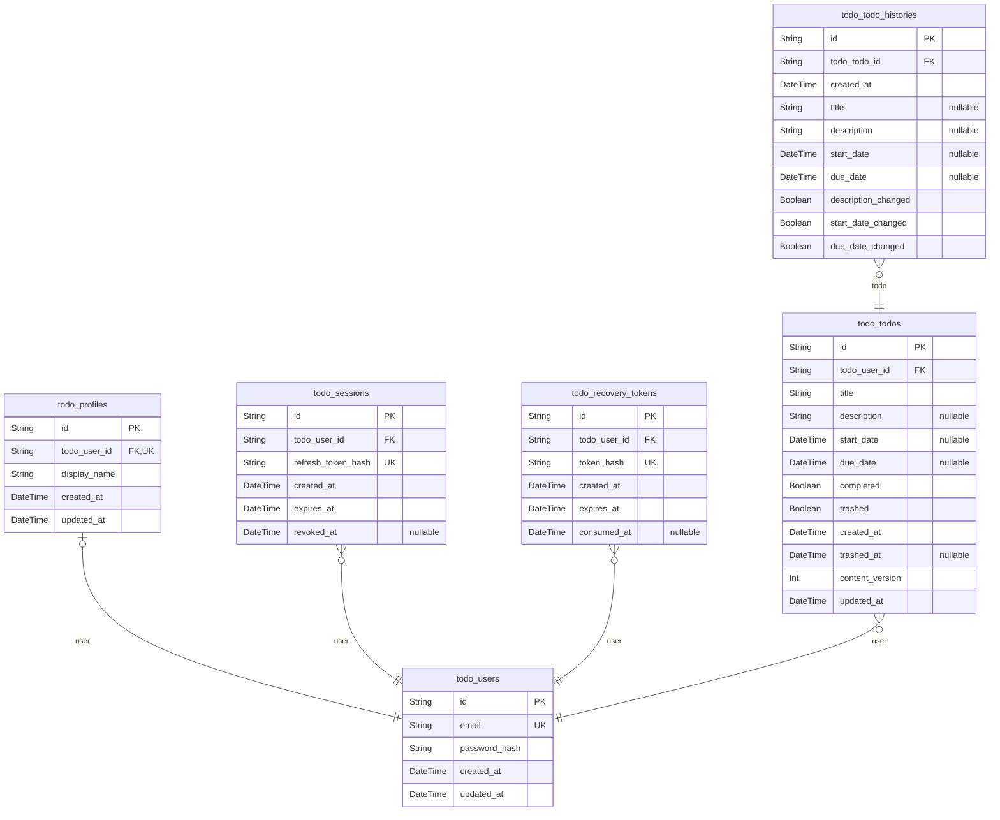

# Prisma Markdown

> Generated by [`prisma-markdown`](https://github.com/samchon/prisma-markdown)

- [default](#default)

## default

### `todo_users`

Credentialed user account and its private ownership boundary.

Properties as follows:

- `id`: Application-assigned UUID.
- `email`: Canonical lower-case, trimmed email used as the stable login identity.
- `password_hash`: Scrypt-derived password verifier; plaintext passwords are never stored.
- `created_at`: Account creation instant.
- `updated_at`: Last credential or account metadata update instant.

### `todo_profiles`

One private display profile attached to exactly one account.

Properties as follows:

- `id`: Application-assigned UUID.
- `todo_user_id`: Owning account UUID.
- `display_name`: Current normalized display name.
- `created_at`: Profile creation instant.
- `updated_at`: Last display-name update instant.

### `todo_sessions`

One authenticated device/session for an account.

Properties as follows:

- `id`: Application-assigned UUID.
- `todo_user_id`: Owning account UUID.
- `refresh_token_hash`: Hash of the issued refresh proof.
- `created_at`: Session creation instant.
- `expires_at`: Expiry instant after which the session cannot refresh.
- `revoked_at`: Set when this session is ended; null means currently valid.

### `todo_recovery_tokens`

A one-time email recovery proof recorded at the delivery boundary.

Properties as follows:

- `id`: Application-assigned UUID.
- `todo_user_id`: Account UUID receiving the proof.
- `token_hash`: Hash of the one-time proof held by the delivery boundary.
- `created_at`: Time the proof was created.
- `expires_at`: Time after which the proof is invalid.
- `consumed_at`: Set when the proof is consumed; null means unused.

### `todo_todos`

A privately owned Todo with independent completion and availability state.

Properties as follows:

- `id`: Application-assigned UUID.
- `todo_user_id`: Permanent owning account UUID.
- `title`: Required normalized short task title.
- `description`: Optional full task details; null means no description was supplied.
- `start_date`: Optional calendar start date stored at UTC midnight; null means unset.
- `due_date`: Optional calendar due date stored at UTC midnight; null means unset.
- `completed`: Completion state, exactly `incomplete` or `complete`.
- `trashed`: Availability state, exactly `active` or `trashed`.
- `created_at`: Creation instant that never changes through the lifecycle.
- `trashed_at`: Most recent move into trash; null while never trashed or currently active.
- `content_version`: Optimistic content version incremented for each accepted content edit.
- `updated_at`: Last successful content-edit instant used for stale-edit detection.

### `todo_todo_histories`

One immutable record of changed-to content from one accepted Todo edit.

Properties as follows:

- `id`: Application-assigned UUID.
- `todo_todo_id`: Todo UUID whose content was edited.
- `created_at`: Edit instant, ordered newest first in the public history operation.
- `title`: Changed-to title; null means title did not participate in this edit.
- `description`: Changed-to description; null means absent, while empty string records a clear.
- `start_date`: Changed-to start date; null means absent or explicitly cleared by a flag.
- `due_date`: Changed-to due date; null means absent or explicitly cleared by a flag.
- `description_changed`: Whether the description value participated, including an explicit clear.
- `start_date_changed`: Whether the start date value participated, including an explicit clear.
- `due_date_changed`: Whether the due date value participated, including an explicit clear.
