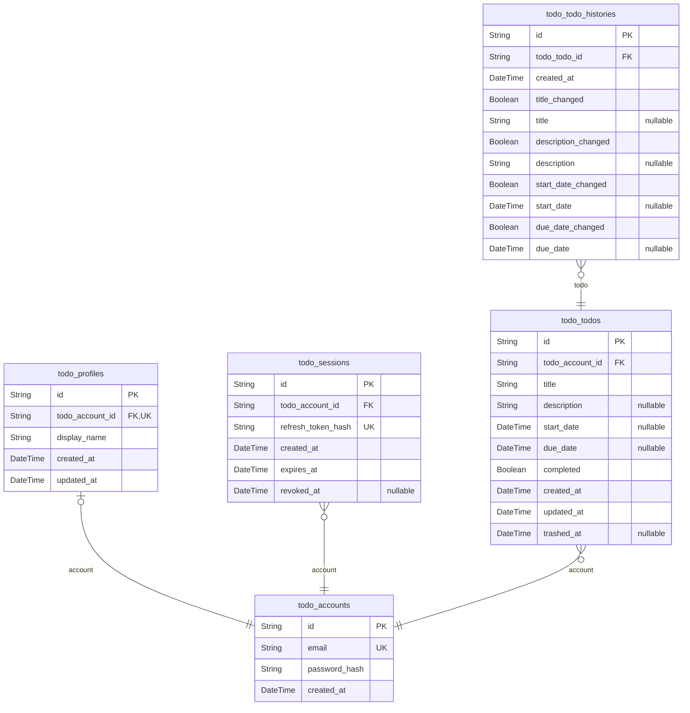

# Prisma Markdown

> Generated by [`prisma-markdown`](https://github.com/samchon/prisma-markdown)

- [default](#default)

## default

### `todo_accounts`

Credentialed account identity used by the private Todo product.

Properties as follows:

- `id`: Application-assigned UUID.
- `email`: Canonical lower-case, trimmed login email.
- `password_hash`: Password hash; plaintext credentials never persist.
- `created_at`: Account creation instant.

### `todo_profiles`

Private display profile paired one-to-one with an account.

Properties as follows:

- `id`: Application-assigned UUID.
- `todo_account_id`: Owning account identifier.
- `display_name`: Current private display name.
- `created_at`: Profile creation instant.
- `updated_at`: Last display-name change instant.

### `todo_sessions`

One authenticated connection for an account.

Properties as follows:

- `id`: Application-assigned UUID.
- `todo_account_id`: Owning account identifier.
- `refresh_token_hash`: Hash of the issued refresh proof.
- `created_at`: Session creation instant.
- `expires_at`: Refresh proof expiry instant.
- `revoked_at`: Revocation instant; null means currently valid.

### `todo_todos`

Private Todo owned by one account with independent completion and trash
availability dimensions.

Properties as follows:

- `id`: Application-assigned UUID.
- `todo_account_id`: Owning account identifier.
- `title`: Required task title after trimming.
- `description`: Optional task description; null means empty.
- `start_date`: Optional calendar start date at UTC midnight.
- `due_date`: Optional calendar due date at UTC midnight.
- `completed`: Completion state; false is incomplete and true is complete.
- `created_at`: Original creation instant.
- `updated_at`: Last content or completion update instant.
- `trashed_at`: Most recent move-to-trash instant; null means active.

### `todo_todo_histories`

Immutable changed-to values for one accepted Todo content edit.

Properties as follows:

- `id`: Application-assigned UUID.
- `todo_todo_id`: Owning Todo identifier.
- `created_at`: Edit instant.
- `title_changed`: Whether title participated in this edit.
- `title`: Changed-to title when title_changed is true.
- `description_changed`: Whether description participated in this edit.
- `description`: Changed-to description; null means explicitly cleared.
- `start_date_changed`: Whether start date participated in this edit.
- `start_date`: Changed-to start date; null means explicitly cleared.
- `due_date_changed`: Whether due date participated in this edit.
- `due_date`: Changed-to due date; null means explicitly cleared.
