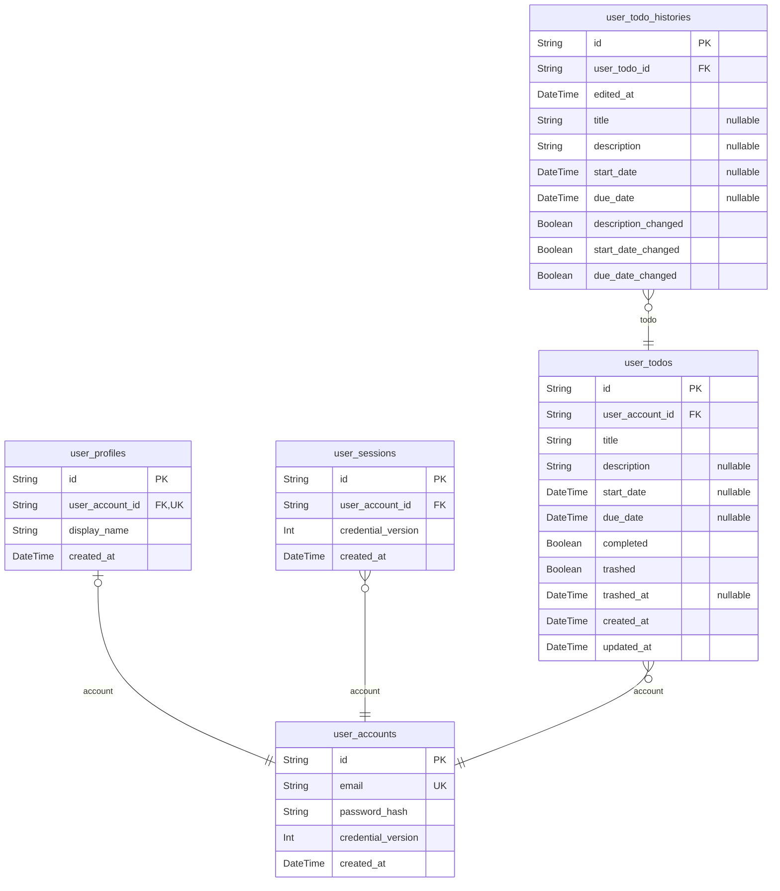

# Prisma Markdown

> Generated by [`prisma-markdown`](https://github.com/samchon/prisma-markdown)

- [default](#default)

## default

### `user_accounts`

Credentialed private account.

Properties as follows:

- `id`: Primary identifier.
- `email`: Canonical lower-case, trimmed email identity.
- `password_hash`: Password hash produced by the backend.
- `credential_version`: Credential replacement generation; incrementing it invalidates old tokens.
- `created_at`: Account creation instant.

### `user_profiles`

One-to-one private display profile.

Properties as follows:

- `id`: Primary identifier.
- `user_account_id`: Owning account identifier.
- `display_name`: Current trimmed display name.
- `created_at`: Profile creation instant.

### `user_sessions`

One authenticated connection for an account.

Properties as follows:

- `id`: Primary identifier.
- `user_account_id`: Owning account identifier.
- `credential_version`: Credential generation accepted when this session was issued.
- `created_at`: Session creation instant.

### `user_todos`

Private todo owned permanently by one account.

Properties as follows:

- `id`: Primary identifier.
- `user_account_id`: Owning account identifier.
- `title`: Required task title.
- `description`: Optional task description. Null means no description.
- `start_date`: Optional intended start calendar date. Null means unset.
- `due_date`: Optional intended due calendar date. Null means unset.
- `completed`: Completion state: incomplete or complete.
- `trashed`: Availability state: active or trashed.
- `trashed_at`: Most recent move into trash. Null while active.
- `created_at`: Original creation instant.
- `updated_at`: Latest accepted content-edit instant, or creation instant before edits.

### `user_todo_histories`

Immutable snapshot of one accepted todo content edit.

Properties as follows:

- `id`: Primary identifier.
- `user_todo_id`: Todo whose content was edited.
- `edited_at`: Edit instant.
- `title`: New title when title participated in the edit; null otherwise.
- `description`: New description when description participated; null otherwise.
- `start_date`: New start date when start date participated; null otherwise.
- `due_date`: New due date when due date participated; null otherwise.
- `description_changed`: Whether the description field participated, preserving an explicit clear.
- `start_date_changed`: Whether the start date field participated, preserving an explicit clear.
- `due_date_changed`: Whether the due date field participated, preserving an explicit clear.
