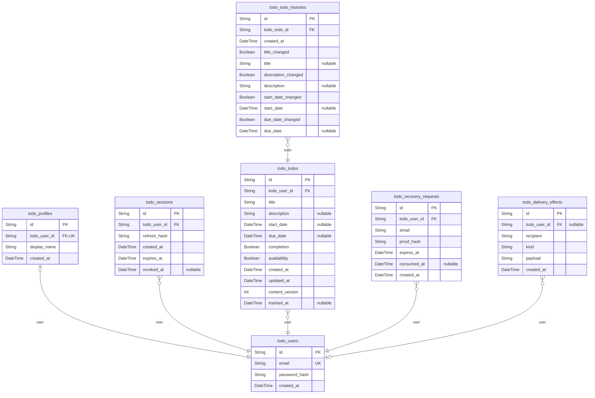

# Prisma Markdown

> Generated by [`prisma-markdown`](https://github.com/samchon/prisma-markdown)

- [default](#default)

## default

### `todo_users`

Credentialed private Todo account.

Properties as follows:

- `id`: Primary identifier.
- `email`: Canonical lower-case, trimmed login email.
- `password_hash`: Password hash; never exposed through the API.
- `created_at`: Account creation instant.

### `todo_profiles`

The one private display profile belonging to an account.

Properties as follows:

- `id`: Primary identifier.
- `todo_user_id`: Owning account identifier.
- `display_name`: Current trimmed display name.
- `created_at`: Profile creation instant.

### `todo_sessions`

One authenticated device/session for an account.

Properties as follows:

- `id`: Primary identifier embedded in signed tokens.
- `todo_user_id`: Owning account identifier.
- `refresh_hash`: Hash of the current refresh secret.
- `created_at`: Session creation instant.
- `expires_at`: Refresh expiry instant.
- `revoked_at`: Session invalidation instant, or null while valid.

### `todo_todos`

A privately owned Todo with independent content and availability state.

Properties as follows:

- `id`: Primary identifier.
- `todo_user_id`: Owning account identifier.
- `title`: Required trimmed task title.
- `description`: Optional task details; null means empty.
- `start_date`: Optional date-only planning start.
- `due_date`: Optional date-only planning due date.
- `completion`: Completion flag: false is `incomplete`, true is `complete`.
- `availability`: Availability flag: true is `active`, false is `trashed`.
- `created_at`: Original creation instant.
- `updated_at`: Last content mutation instant.
- `content_version`: Incremented for each accepted content edit.
- `trashed_at`: Most recent move into trash, or null while never trashed.

### `todo_todo_histories`

Immutable record of one accepted Todo content edit.

Properties as follows:

- `id`: Primary identifier.
- `todo_todo_id`: Todo whose content was edited.
- `created_at`: Edit instant.
- `title_changed`: True when title participated in this edit.
- `title`: New title when title_changed is true.
- `description_changed`: True when description participated in this edit.
- `description`: New description, including null when explicitly cleared.
- `start_date_changed`: True when start date participated in this edit.
- `start_date`: New start date, including null when explicitly cleared.
- `due_date_changed`: True when due date participated in this edit.
- `due_date`: New due date, including null when explicitly cleared.

### `todo_recovery_requests`

One email recovery proof stored behind the delivery boundary.

Properties as follows:

- `id`: Primary identifier.
- `todo_user_id`: Account receiving the proof.
- `email`: Canonical email submitted for recovery.
- `proof_hash`: Hash of the one-time proof.
- `expires_at`: Proof expiry instant.
- `consumed_at`: Consumption instant, or null while unused.
- `created_at`: Request creation instant.

### `todo_delivery_effects`

Durable record for an outbound effect the local workspace cannot deliver.

Properties as follows:

- `id`: Primary identifier.
- `todo_user_id`: Optional account recipient; null for a non-account effect.
- `recipient`: Recipient address.
- `kind`: Effect kind.
- `payload`: Effect payload, including any secret held by the delivery boundary.
- `created_at`: Recording instant.
